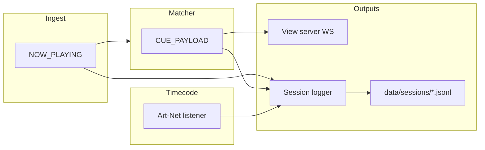

# M10 — Session cue log (clip → match audit trail)

Build plan for an append-only **session log** of watched-track clip changes and resolved sheet
matches (with SMPTE-style timestamps), controlled from the admin **Settings** page. Distinct from
structured **ops logging** (`pino` / optional `LOG_FILE` in `src/core/logger.js`).

**Agent workflow:** one sub-milestone (M10a–M10c) per session/commit. Run `npm test` after each
stage. Prototype with `npm run sim` before show validation.

**Related:** [`ableview_spec_from_claude.md`](../../ableview_spec_from_claude.md) §9.1
(`NowPlaying`), §9.2 (`CuePayload`), [`AGENTS.md`](../../AGENTS.md), [`ROADMAP.md`](../../ROADMAP.md).

---

## 1. Goal and non-goals

### Goal

- While logging is **on**, append one record per **meaningful show event** to a **single**
  session file under `data/` (JSON Lines).
- Two **event types** in the same file (distinguished by `event`):
  - **`track_clip`** — a watched track's playing clip or slot changed (raw Ableton timeline).
  - **`match`** — the authoritative cue clip's Google Sheet resolution changed (operator-facing
    match outcome).
- Each record includes an **SMPTE-style timestamp**: Art-Net timecode when the signal is live,
  otherwise local wall clock in the same `HH:MM:SS:FF` display format (see §4.1, §7.4).
- **Settings UI** (`public/views/settings.html` + session-log panel):
  - Toggle logging on/off at runtime.
  - Set **session name** (basename); changing name **starts a new file** (rotate), preserving
    the previous file.
  - Show current file path, line count, logging enabled state.
- **Config defaults** in `config.json`: directory, default session name, whether to auto-start
  logging on boot (with sim-friendly default documented in example config).

### Non-goals

- Replacing or duplicating `pino` application logs.
- High-frequency transport logging (tempo/beat ticks while clips are held).
- **Separate log files** for clips vs matches (one JSONL per session name; filter by `event`).
- CSV as the primary format in v1 (optional later; JSONL is the contract).
- Logging admin sheet row edits as separate events (unless added in a follow-up; see §12).
- Authenticated download API or multi-user ACL (admin/settings URL is the trust boundary, same
  as existing config API).
- Any OSC or Ableton interaction (NFR-1 unchanged).

---

## 2. Architecture

```
  ingest / sim
       → NOW_PLAYING ──────────────→ session logger (track_clip events)
       → matcher → CUE_PAYLOAD ──┬──→ view server (WS cue)
                                 │
                                 └──→ session logger (match events)
                                        append JSONL when policy says "log this"
                                        rotate file on session name change

  Art-Net UDP
       → timecode listener ────────→ getTimecodeStatus() ──→ timestamp at append

  admin Settings
       → GET/PATCH /api/session-log  (runtime state, NOT config.json session name)
       → PATCH may include enabled + sessionName → rotate if name changes while enabled
```



**Integration points:**

- Subscribe to **`EVENTS.NOW_PLAYING`** for per-track clip diffs (`track_clip` events).
- Subscribe to **`EVENTS.CUE_PAYLOAD`** for sheet match diffs (`match` events).
- Inject **`getTimecodeStatus`** from the existing timecode listener (same handle passed to
  health/admin today).
- Do **not** modify matcher or ingest dedupe logic—implement separate dedupe state in the logger
  (§6).

**Bootstrap:** `src/index.js` — create logger after `createBus()` and `createTimecodeListener()`,
pass `getConfig`, `getTimecodeStatus: () => timecode.getStatus()`, and
`getSimulated: () => ingest.simulated`. Call `sessionLog.start()` after view server is up (or
before `ingest.start()`), `sessionLog.stop()` in shutdown handler before exit.

**Server:** register REST routes from `src/server/session-log-api.js`; inject `sessionLog`
handle from bootstrap (same pattern as `sheetsActions` / `simActions`).

---

## 3. Open decisions (defaults for implementation)

| ID | Topic | Default for M10 |
|---|---|---|
| OD-L1 | File format | **JSONL** (one JSON object per line, UTF-8) |
| OD-L2 | Directory | `./data/sessions` (gitignored via existing `data/*`) |
| OD-L3 | Default session basename on rotate | ISO date + time local-safe slug, e.g. `session-2026-07-27T22-15-00Z` |
| OD-L4 | Auto-start on boot | **`sessionLog.autoStart: false`** in committed example; **`true` only when `sim.enabled`** if `sessionLog.autoStartWhenSim: true` (both configurable) |
| OD-L5 | Default basename when sim auto-starts | **`test`** → file `test.jsonl` (operator can rename/rotate before rehearsal) |
| OD-L6 | Row payload in match events | **Full `row` object** when `match.matched === true` (same as `CuePayload.row`); omit `row` when no match |
| OD-L7 | Transport-only `CUE_PAYLOAD` | **Do not log** a `match` event (same authoritative clip + match fingerprint, only tempo/beat/pendingLaunch changed) |
| OD-L8 | Rematch same clip | **Do log** a `match` event when match fingerprint changes (§6.3) |
| OD-L9 | Runtime vs persisted session name | **Runtime only** in API + sidecar `data/sessions/.active.json`; **do not** write active session name into `config.json` on each rotate |
| OD-L10 | Configurable via admin settings form | **`sessionLog.autoStartWhenSim`** and **`sessionLog.directory`** editable via existing `/api/config/settings` only if added to `EDITABLE_SECTIONS`; **enabled + active session name** via `/api/session-log` only |
| OD-L11 | Log file layout | **Single file** per session name; **`event`** field distinguishes `track_clip` vs `match` |
| OD-L12 | Timestamp | **`timestamp`** = Art-Net SMPTE display when `timecode.live === true`; else local wall clock as `HH:MM:SS:00` (frames `00`, colon separator). **`timestampSource`**: `"artnet"` \| `"clock"`. Optional **`loggedAt`** ISO8601 for absolute ordering/debug |
| OD-L13 | Watched-track scope | Log **`track_clip`** for every entry in `NowPlaying.tracks` (ingest already filters to watched tracks). Diff per `(trackIndex, clipName, slotIndex)` |

---

## 4. Data contracts

### 4.1 Log records (one JSONL line each)

All records share a common timestamp envelope. Event-specific fields vary by `event`.

#### Shared fields (all events)

| Field | Required | Notes |
|---|---|---|
| `timestamp` | yes | SMPTE-style display string, e.g. `01:23:45:12` or `01:23:45;12` (DF). From Art-Net when live, else wall clock (§7.4) |
| `timestampSource` | yes | `"artnet"` \| `"clock"` |
| `loggedAt` | no | ISO8601 append time; recommended for cross-session sort and debugging |
| `event` | yes | `"track_clip"` \| `"match"` |
| `sessionName` | yes | Basename (no path) active when line written |
| `simulated` | yes | From `NowPlaying` / payload |
| `tempo`, `beat` | yes | From the source event (may be null) |
| `pendingLaunch` | yes | From the source event |

#### `event: "track_clip"`

Emitted when a watched track's playing clip or slot changes (§6.2).

```json
{
  "timestamp": "01:23:45:12",
  "timestampSource": "artnet",
  "loggedAt": "2026-07-27T22:15:04.512Z",
  "event": "track_clip",
  "trackIndex": 3,
  "trackName": "Vocals",
  "clipName": "Sample Hit",
  "slotIndex": 4,
  "authoritativeClip": "Song A - Intro",
  "tempo": 128,
  "beat": 12,
  "pendingLaunch": false,
  "simulated": false,
  "sessionName": "test"
}
```

| Field | Required | Notes |
|---|---|---|
| `trackIndex` | yes | Ableton track index |
| `trackName` | yes | Track name from session |
| `clipName` | yes | Playing clip name; `null` when stopped |
| `slotIndex` | yes | Playing slot; `null` when stopped |
| `authoritativeClip` | yes | Cue-track authoritative clip at this moment (context for correlation) |

One line **per changed track** on each qualifying `NOW_PLAYING` event. If two tracks change in
the same ingest tick, append two lines (same `timestamp` is fine).

#### `event: "match"`

Emitted when the authoritative clip's sheet resolution changes (§6.3).

```json
{
  "timestamp": "01:23:45:12",
  "timestampSource": "artnet",
  "loggedAt": "2026-07-27T22:15:04.512Z",
  "event": "match",
  "clipName": "Song A - Intro",
  "match": {
    "matched": true,
    "confidence": 0.92,
    "rowId": "12",
    "matchedValue": "Song A - Intro",
    "viaAlias": false
  },
  "row": { "Song Title": "Song A - Intro", "Key": "A minor", "BPM": "128" },
  "reason": "clip_change",
  "syncedAt": "2026-07-27T22:12:00.000Z",
  "stale": false,
  "tempo": 128,
  "beat": 12,
  "pendingLaunch": false,
  "simulated": false,
  "sessionName": "test"
}
```

| Field | Required | Notes |
|---|---|---|
| `clipName` | yes | Authoritative cue clip; `null` when cleared |
| `match` | yes | Same shape as `CuePayload.match` (`makeMatchResult`) |
| `row` | no | Present when matched and row exists on payload |
| `syncedAt`, `stale` | yes | From payload |
| `reason` | yes | `"clip_change"` \| `"match_change"` (§6.3) |

**Correlation:** A cue-track clip change typically produces **both** a `track_clip` line (for
the Cue track) and a `match` line (new sheet row). Non-authoritative track changes produce
**only** `track_clip`. Sheet sync / rematch with the same clip produces **only** `match` with
`reason: "match_change"`.

**Do not** log internal dedupe keys in the file unless a debugging flag is added later.

### 4.2 Sidecar `data/sessions/.active.json`

Persist runtime across process restart without polluting `config.json`.

```json
{
  "enabled": true,
  "sessionName": "show-night-1",
  "fileName": "show-night-1.jsonl",
  "startedAt": "2026-07-27T20:00:00.000Z",
  "lineCount": 42
}
```

- Updated after each append (prefer **after each append** for simplicity in M10).
- On startup: if file missing, use config defaults only.
- **Gitignored** (under `data/`).

### 4.3 REST: `GET /api/session-log`

```json
{
  "enabled": true,
  "sessionName": "test",
  "filePath": "data/sessions/test.jsonl",
  "absolutePath": "C:/dev/AbleView/data/sessions/test.jsonl",
  "lineCount": 15,
  "startedAt": "2026-07-27T20:00:00.000Z",
  "lastLoggedAt": "2026-07-27T20:15:04.512Z",
  "config": {
    "directory": "./data/sessions",
    "autoStart": false,
    "autoStartWhenSim": true
  }
}
```

- `absolutePath` helps operators find files on the NUC; use `resolve(cwd, relativePath)`.
- If logging disabled: `filePath` may be null, `lineCount` 0.

### 4.4 REST: `PATCH /api/session-log`

Body (all fields optional):

```json
{
  "enabled": true,
  "sessionName": "rehearsal-2"
}
```

Behavior:

1. **`enabled: false`** — stop appending; flush/close stream; keep `sessionName` and sidecar
   for next enable.
2. **`enabled: true`** — open append stream to current session file (create if missing).
3. **`sessionName`** — sanitize (§8); if different from active name:
   - Close current stream.
   - Set new name; open **new** file `{sessionName}.jsonl` (append if file already exists—
     document that reusing a name continues the file).
   - Reset `startedAt` for this session segment; do **not** delete old file.

Errors: `400` with `{ "error": "..." }` for invalid name, path escape, etc.

Response: same shape as `GET`.

**No DELETE in M10** (operators delete files manually or via OS).

---

## 5. Configuration

Add to `config/config.example.json` and `DEFAULTS` in `src/config/index.js`:

```json
{
  "sessionLog": {
    "directory": "./data/sessions",
    "autoStart": false,
    "autoStartWhenSim": true,
    "defaultSessionName": "test"
  }
}
```

Validation in `validateConfig`:

- `directory` non-empty string.
- `defaultSessionName` non-empty after sanitize rules (or sanitize on load).
- Booleans for `autoStart`, `autoStartWhenSim`.

**Serialize** in `serializeFileConfig` / `config.example.json`; **do not** add `sessionLog` to
`EDITABLE_SECTIONS` in M10 unless explicitly doing M10c config fields—runtime API is enough for
enable/name.

**Boot logic** (`createSessionLogger.start()`):

```
if sidecar.enabled → restore session
else if config.sessionLog.autoStart → enable with defaultSessionName
else if config.sessionLog.autoStartWhenSim && config.sim.enabled → enable with defaultSessionName
else → disabled
```

---

## 6. Event filtering (critical — implement exactly)

### 6.1 Ingest / matcher behavior (context)

**`NOW_PLAYING`** (from `src/ingest/sources/abletonosc.js` and simulator):

- Emits when authoritative clip, pending launch, **tracks array**, tempo, or beat changes.
- `tracks[]` lists all **watched** tracks with `{ trackIndex, trackName, clipName, slotIndex }`.

**`CUE_PAYLOAD`** (from `src/match/index.js`):

- Emits on any `nowPlayingKey` change, or `force: true` on rematch.
- May emit **transport-only** payloads: same authoritative clip + source, updated tempo/beat only
  (`transportOnly` branch)—tracks array may still update without authoritative clip change.

### 6.2 `track_clip` — `NOW_PLAYING` handler

Maintain on the session logger instance:

```js
lastTrackState = null;  // Map or JSON.stringify of trackIndex -> { clipName, slotIndex }
```

Define helper:

```js
function trackStateKey(tracks) {
  return JSON.stringify(
    (tracks ?? [])
      .map((t) => [t.trackIndex, t.clipName ?? null, t.slotIndex ?? null])
      .sort((a, b) => a[0] - b[0])
  );
}

function diffTracks(prevTracks, nextTracks) {
  // return array of { trackIndex, trackName, clipName, slotIndex } that changed
}
```

On each `NOW_PLAYING` event (when logging enabled):

```
nextKey = trackStateKey(event.tracks)
if (nextKey === lastTrackState) SKIP
changed = diffTracks(parsed(lastTrackState), event.tracks)
for (track of changed) {
  append { event: 'track_clip', ...track fields, authoritativeClip: event.authoritativeClip, ... }
}
lastTrackState = nextKey
```

When logging is **disabled**, prefer **reset `lastTrackState` on disable** so the first event
after re-enable logs even if tracks unchanged.

When **`enabled` toggles true**, reset `lastTrackState` so the next `NOW_PLAYING` logs current
state.

**Do not** emit `track_clip` for tempo/beat-only `NOW_PLAYING` events—the ingest dedupes those
before emit, so if `NOW_PLAYING` fires, at least one meaningful field (including tracks) changed.

### 6.3 `match` — `CUE_PAYLOAD` handler

Maintain:

```js
lastClipKey = null;   // JSON.stringify({ clip: clipName ?? null, simulated: bool })
lastMatchKey = null;  // JSON.stringify({ clip, matched, confidence, rowId, matchedValue, viaAlias })
```

Define helpers:

```js
function clipKey(payload) {
  return JSON.stringify({ clip: payload.clipName ?? null, simulated: !!payload.simulated });
}

function matchKey(payload) {
  const m = payload.match ?? {};
  return JSON.stringify({
    clip: payload.clipName ?? null,
    matched: !!m.matched,
    confidence: m.confidence ?? 0,
    rowId: m.rowId ?? null,
    matchedValue: m.matchedValue ?? null,
    viaAlias: !!m.viaAlias,
  });
}
```

On each `CUE_PAYLOAD` (when logging enabled):

```
ck = clipKey(payload)
mk = matchKey(payload)

if (ck !== lastClipKey) {
  reason = 'clip_change'
  append { event: 'match', reason, ...payload fields }
} else if (mk !== lastMatchKey) {
  reason = 'match_change'   // rematch / sheet sync / threshold change
  append { event: 'match', reason, ...payload fields }
} else {
  SKIP   // transport-only or duplicate
}

lastClipKey = ck
lastMatchKey = mk
```

When logging is **disabled**, **reset** `lastClipKey` / `lastMatchKey` on disable.

When **`enabled` toggles true**, reset keys so the next payload logs even if clip unchanged.

### 6.4 Ordering when both fire

On a cue-track clip change, ingest emits `NOW_PLAYING` then matcher emits `CUE_PAYLOAD`. Logger
handlers run in subscription order—subscribe to `NOW_PLAYING` **before** `CUE_PAYLOAD` so
`track_clip` lines appear before the corresponding `match` line in the file.

Use the **same** `resolveLogTimestamp(getTimecodeStatus())` call per append (timestamps may differ
by a few ms if Art-Net is updating; that is acceptable).

### 6.5 `manual_rematch` reason

Not used in M10. Use `match_change` for all rematch-induced diffs.

---

## 7. Module design

### 7.1 `src/session-log/index.js`

Export `createSessionLogger({ bus, getConfig, getTimecodeStatus, log, cwd })`:

| Method | Purpose |
|---|---|
| `start()` | mkdir directory, load sidecar, apply boot auto-start, subscribe bus |
| `stop()` | unsubscribe, end stream, flush |
| `getStatus()` | object for GET API |
| `applyPatch({ enabled, sessionName })` | PATCH logic |
| `handleNowPlaying(event)` | internal; `track_clip` logic |
| `handleCuePayload(payload)` | internal; `match` logic |

**File I/O:**

- Use `fs.createWriteStream(path, { flags: 'a' })` for append.
- On each line: `stream.write(JSON.stringify(record) + '\n')`.
- Call `stream.end()` on rotate/disable/stop.
- No extra dependencies.

**Line count:** increment in memory on each write; in-memory counter is enough for M10.

### 7.2 `src/session-log/sanitize.js`

```js
export function sanitizeSessionName(raw) {
  // trim, max length 80, replace unsafe chars with '-'
  // reject '', '.', '..', strings containing path separators or null bytes
  // return sanitized or throw Error with message for API
}

export function sessionFilePath(directory, sessionName, cwd) {
  // resolve directory under cwd, join `${sessionName}.jsonl`
  // assert resolved path starts with resolved directory (no .. escape)
}
```

### 7.3 `src/session-log/timestamp.js`

```js
import { formatTimecodeDisplay } from '../core/timecode.js';

export function resolveLogTimestamp(getTimecodeStatus) {
  const status = getTimecodeStatus?.() ?? {};
  if (status.enabled === true && status.live === true && status.timecode?.display) {
    return {
      timestamp: status.timecode.display,
      timestampSource: 'artnet',
    };
  }
  const now = new Date();
  return {
    timestamp: formatTimecodeDisplay({
      hours: now.getHours(),
      minutes: now.getMinutes(),
      seconds: now.getSeconds(),
      frames: 0,
      dropFrame: false,
    }),
    timestampSource: 'clock',
  };
}
```

- Reuse `formatTimecodeDisplay` from `src/core/timecode.js` (same colon/semicolon rules as
  Art-Net display).
- Clock fallback always uses **frames `00`** and **colon** separator (no drop-frame semantics
  for wall clock).

### 7.4 `src/server/session-log-api.js`

`registerSessionLogRoutes(app, { sessionLog, log })` — thin wrappers.

---

## 8. Path safety

- Session names: `[a-zA-Z0-9._-]+` after sanitization (spaces → `-`).
- Reject `..`, `/`, `\`, `:`, `*`, `?`, `"`, `<`, `>`, `|`.
- Resolved log file must stay under resolved `sessionLog.directory`.
- Never accept `filePath` from client—only `sessionName`.

---

## 9. Build stages

### M10a — Core logger + tests (no HTTP, no UI)

**Scope**

- Config section + validation + `config.example.json`.
- `src/session-log/` (logger, sanitize, timestamp, sidecar read/write).
- Subscribe to **`EVENTS.NOW_PLAYING`** and **`EVENTS.CUE_PAYLOAD`** in `src/index.js`; pass
  `getTimecodeStatus`; shutdown hook.
- Unit tests with temp directory and manual bus emits.

**Files (expected)**

- `src/session-log/index.js`
- `src/session-log/sanitize.js`
- `src/session-log/timestamp.js`
- `src/config/index.js`
- `src/config/runtime.js` — add `sessionLog` to `serializeFileConfig` only
- `config/config.example.json`
- `src/index.js`
- `test/session-log.test.js`
- `test/session-log-timestamp.test.js` (optional; may live in `session-log.test.js`)

**Acceptance**

- With logging enabled, `NOW_PLAYING` with a watched-track clip change appends `track_clip` line(s).
- Vocals clip change while Cue unchanged appends **only** `track_clip` (no `match`).
- Cue-track clip change appends `track_clip` **and** `match` with `reason: "clip_change"`.
- Transport-only second `CUE_PAYLOAD` with same clip does **not** append a second `match` line.
- Rematch with different `rowId` **does** append `match` with `reason: "match_change"`.
- `clipName: null` clear logs appropriate `match` line.
- Timestamp uses Art-Net display when `getTimecodeStatus()` reports live; else clock fallback.
- `npm test` green; NFR-1 untouched.

**Agent prompt**

> Implement M10a per `docs/plans/M10-session-cue-log.md`: `sessionLog` config, session logger
> module with `track_clip` + `match` handlers (§6), Art-Net timestamp helper (§7.3), bus
> subscriptions, fixture tests. No REST or admin UI.

---

### M10b — REST API + wiring

**Scope**

- `registerSessionLogRoutes` on view server.
- Pass `sessionLog` from `src/index.js` into `createViewServer`.
- PATCH rotate + enable/disable; GET status.

**Files (expected)**

- `src/server/session-log-api.js`
- `src/server/index.js`
- `test/session-log-api.test.js` (spin up `createViewServer` with mock sessionLog or real logger
  in temp dir—follow `test/server.test.js` patterns)

**Acceptance**

- PATCH enable → subsequent bus events append.
- PATCH `sessionName` → new file; old file unchanged; line count resets for new file.
- Invalid session name → 400.
- `npm test` green.

**Agent prompt**

> Implement M10b per `docs/plans/M10-session-cue-log.md`: GET/PATCH `/api/session-log`, wire
> into server bootstrap, API tests.

---

### M10c — Admin settings UI + runbook

**Scope**

- New fieldset **Session log** on settings page (below sim group or separate row):
  - Checkbox **Enable logging** (maps to PATCH `enabled`—immediate toggle).
  - Text input **Session name** + button **Start new session file** (PATCH with name).
  - Read-only status: path, line count, last logged time.
- Minimal CSS in `public/shared/styles.css` if needed (reuse `settings-*` classes).
- Update `ROADMAP.md` M10 row when complete.

**UX recommendation (implement as specified):**

- **Toggle** calls `PATCH { enabled }` immediately; show banner on error.
- **Session name** input + **Apply** calls `PATCH { sessionName }`; **applying name enables
  logging** for fewer clicks.
- Poll `GET /api/session-log` every 5s or refresh after toggle/apply.

**Files (expected)**

- `public/shared/admin-session-log.js` (new module) mounted from `settings.html`.
- `public/views/settings.html` — mount panel below settings form.

**Acceptance**

- `npm run sim` with `autoStartWhenSim: true`: `data/sessions/test.jsonl` grows on clip changes.
- Settings page shows status; rename creates new file.
- `npm test` green.

**Agent prompt**

> Implement M10c per `docs/plans/M10-session-cue-log.md`: settings UI for session log, mount on
> settings.html, manual QA steps in §10.

---

## 10. Operator runbook

1. Before rehearsal: open **Settings** (`/views/settings.html`).
2. Enable Art-Net timecode in settings if the show sends SMPTE (optional but recommended for log
   timestamps).
3. Set session name (e.g. `rehearsal-july-27`); enable logging.
4. Run show or sim; confirm **line count** increases on clip changes (not every beat).
5. To start a new segment: change session name → **Apply** (previous `.jsonl` remains on disk).
6. After show: copy files from `data/sessions/` off the NUC for analysis.

**Example jq:**

```bash
# All cue-track match events
jq -c 'select(.event == "match") | {timestamp, clipName, matched: .match.matched}' data/sessions/show-night-1.jsonl

# All watched-track clip fires
jq -c 'select(.event == "track_clip") | {timestamp, trackName, clipName}' data/sessions/show-night-1.jsonl

# Timeline merged (both event types)
jq -c '{timestamp, event, track: .trackName, clip: (.clipName // .authoritativeClip)}' data/sessions/show-night-1.jsonl
```

---

## 11. Testing checklist (for agents)

| Test | File |
|---|---|
| Sanitize rejects `../evil` | `test/session-log.test.js` |
| `track_clip` on watched-track change only | `test/session-log.test.js` |
| Cue change → `track_clip` + `match` | `test/session-log.test.js` |
| Filter skips transport-only `match` | `test/session-log.test.js` |
| Filter logs `match_change` after rematch | `test/session-log.test.js` |
| Timestamp artnet vs clock fallback | `test/session-log.test.js` or `session-log-timestamp.test.js` |
| Rotate creates two files | `test/session-log.test.js` or API test |
| GET/PATCH 400 bad name | `test/session-log-api.test.js` |
| Sidecar restored on restart | optional integration test with stop/start logger |

Use `node:test`, `assert`, temp dir via `fs.mkdtempSync` under `os.tmpdir()`.

---

## 12. Future extensions (out of M10 scope)

- **`event: deck_on_air`** — external DJ program sources (Djay Pro deck bridges on performer
  Macs). Log **on-air transitions only** when `sessionLog.logExternalOnAir` is enabled. Build
  plan: [`M13-external-deck-monitor.md`](./M13-external-deck-monitor.md) (M13e).
- **`event: sheet_edit`** lines when `PATCH /api/sheets/rows/:rowId` succeeds.
- **CSV export** endpoint with fixed column list from config.
- **`sessionLog.includeColumns`** — whitelist row fields to reduce PII/size.
- **Download** `GET /api/session-log/download` (Content-Disposition).
- **Max file size** rotation within same session name (`test.001.jsonl`).
- Add `sessionLog` to admin **Save settings** form via `EDITABLE_SECTIONS`.
- Derive clock fallback frames from Ableton beat/tempo when Art-Net is off (richer than `:00`).

---

## 13. Known limitations

- Clock fallback uses **frames `00`** — not sub-frame accurate when Art-Net is unavailable.
- `loggedAt` (when present) reflects append time; `timestamp` reflects Art-Net sample or wall
  clock at append—not ingest `NowPlaying.timestamp`.
- Full row snapshot in `match` events may be **stale** relative to later sheet edits until rematch.
- Reusing a session name **appends** to existing file (by design).
- No encryption; treat `data/sessions/` like cue notes on disk.
- Very fast clip changes: one line per policy event per track; no batching.
- Art-Net stale window (`timecode.staleMs`): timestamps flip to `clock` when signal drops even
  mid-show.

---

## 14. Effort (planning)

| Stage | Agent-assisted (indicative) |
|---|---|
| M10a | ~3–5 hours (dual bus handlers + timestamp helper + tests) |
| M10b | ~1–2 hours |
| M10c | ~2–3 hours |
| **Total** | ~1–1.5 days |

---

## 15. Milestone completion checklist

- [x] M10a — config + logger + dual bus handlers + timestamp + tests
- [x] M10b — REST API + server tests
- [x] M10c — settings UI + sim runbook verified
- [x] `ROADMAP.md` M10 marked done
- [x] Optional one-line in `AGENTS.md` planned modules table (`src/session-log/`)

---

## 16. Copy-paste agent prompts (full chain)

**Session 1 — M10a**

> Implement M10a per `docs/plans/M10-session-cue-log.md` §9 (M10a): add `sessionLog` config,
> `src/session-log/` with JSONL append, `track_clip` (NOW_PLAYING §6.2) and `match`
> (CUE_PAYLOAD §6.3) handlers, `resolveLogTimestamp` (§7.3), wire in `src/index.js` with
> `getTimecodeStatus`, tests in `test/session-log.test.js`. Follow existing patterns in
> `src/sheets/` and `src/core/bus.js`. Run `npm test`. Do not commit unless asked.

**Session 2 — M10b**

> Implement M10b per `docs/plans/M10-session-cue-log.md` §9 (M10b): GET/PATCH
> `/api/session-log`, register routes in `src/server/index.js`, pass session logger from
> `src/index.js`. Add `test/session-log-api.test.js`. Run `npm test`.

**Session 3 — M10c**

> Implement M10c per `docs/plans/M10-session-cue-log.md` §9 (M10c): admin session log panel on
> `public/views/settings.html`, new `public/shared/admin-session-log.js`, styles as needed. Verify
> with `npm run sim`. Update ROADMAP M10 status. Run `npm test`.
