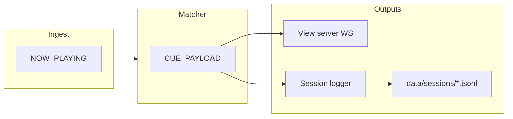

# M10 — Session cue log (clip → match audit trail)

Build plan for an append-only **session log** of authoritative clip changes and resolved sheet
rows (with timestamps), controlled from the admin **Settings** page. Distinct from structured
**ops logging** (`pino` / optional `LOG_FILE` in `src/core/logger.js`).

**Agent workflow:** one sub-milestone (M10a–M10c) per session/commit. Run `npm test` after each
stage. Prototype with `npm run sim` before show validation.

**Related:** [`ableview_spec_from_claude.md`](../../ableview_spec_from_claude.md) §9.2
(`CuePayload`), [`AGENTS.md`](../../AGENTS.md), [`ROADMAP.md`](../../ROADMAP.md).

---

## 1. Goal and non-goals

### Goal

- While logging is **on**, append one record per **meaningful cue event** to a session file
  under `data/` (JSON Lines by default).
- Each record includes: wall-clock timestamp, clip name (or clear), match outcome, confidence,
  row id, optional full matched row, transport metadata, and sim/stale flags.
- **Settings UI** (`public/views/settings.html` + `public/shared/admin-settings.js`):
  - Toggle logging on/off at runtime.
  - Set **session name** (basename); changing name **starts a new file** (rotate), preserving
    the previous file.
  - Show current file path, line count (or bytes), logging enabled state.
- **Config defaults** in `config.json`: directory, default session name, whether to auto-start
  logging on boot (with sim-friendly default documented in example config).

### Non-goals

- Replacing or duplicating `pino` application logs.
- High-frequency transport logging (tempo/beat ticks while the same clip is held).
- CSV as the primary format in v1 (optional later; JSONL is the contract).
- Logging admin sheet row edits as separate events (unless added in a follow-up; see §12).
- Authenticated download API or multi-user ACL (admin/settings URL is the trust boundary, same
  as existing config API).
- Any OSC or Ableton interaction (NFR-1 unchanged).

---

## 2. Architecture

```
  ingest / sim
       → NOW_PLAYING
       → matcher → CUE_PAYLOAD ──┬──→ view server (WS cue)
                                 │
                                 └──→ session logger (NEW)
                                        append JSONL when policy says "log this"
                                        rotate file on session name change

  admin Settings
       → GET/PATCH /api/session-log  (runtime state, NOT config.json session name)
       → PATCH may include enabled + sessionName → rotate if name changes while enabled
```



**Integration point:** subscribe to `EVENTS.CUE_PAYLOAD` in a new module; do **not** modify
matcher dedupe logic for logging—implement a **second** dedupe in the logger (§6).

**Bootstrap:** `src/index.js` — create logger after `createBus()`, pass `getConfig` and
`getSimulated: () => ingest.simulated`, call `sessionLog.start()` after view server is up (or
before ingest.start), `sessionLog.stop()` in shutdown handler before exit.

**Server:** register REST routes from `src/server/session-log-api.js`; inject `sessionLog`
handle from bootstrap (same pattern as `sheetsActions` / `simActions`).

---

## 3. Open decisions (defaults for implementation)

| ID | Topic | Default for M10 |
|---|---|---|
| OD-L1 | File format | **JSONL** (one JSON object per line, UTF-8) |
| OD-L2 | Directory | `./data/sessions` (gitignored via existing `data/*`) |
| OD-L3 | Default session basename on rotate | ISO date + time local-safe slug, e.g. `session-2026-07-27T22-15-00Z` |
| OD-L4 | Auto-start on boot | **`sessionLog.autoStart: false`** in committed example; **`true` only when `sim.enabled`** if `sessionLog.autoStartWhenSim: true` (both configurable) |
| OD-L5 | Default basename when sim auto-starts | **`test`** → file `test.jsonl` (operator can rename/rotate before rehearsal) |
| OD-L6 | Row payload in file | **Full `row` object** when `match.matched === true` (same as `CuePayload.row`); omit `row` when no match |
| OD-L7 | Transport-only `CUE_PAYLOAD` | **Do not log** (same clip + source, only tempo/beat/pendingLaunch changed) |
| OD-L8 | Rematch same clip | **Do log** when match fingerprint changes (§6.2) |
| OD-L9 | Runtime vs persisted session name | **Runtime only** in API + optional sidecar `data/sessions/.active.json`; **do not** write active session name into `config.json` on each rotate |
| OD-L10 | Configurable via admin settings form | **`sessionLog.autoStartWhenSim`** and **`sessionLog.directory`** editable via existing `/api/config/settings` only if added to `EDITABLE_SECTIONS`; **enabled + active session name** via `/api/session-log` only |

---

## 4. Data contracts

### 4.1 Log record (one JSONL line)

Written by session logger; stable field names for downstream tools.

```json
{
  "loggedAt": "2026-07-27T22:15:04.512Z",
  "event": "cue",
  "clipName": "Song A - Intro",
  "match": {
    "matched": true,
    "confidence": 0.92,
    "rowId": "12",
    "matchedValue": "Song A - Intro",
    "viaAlias": false
  },
  "row": { "Song Title": "Song A - Intro", "Key": "A minor", "BPM": "128" },
  "tempo": 128,
  "beat": 12,
  "pendingLaunch": false,
  "syncedAt": "2026-07-27T22:12:00.000Z",
  "stale": false,
  "simulated": false,
  "sessionName": "test",
  "reason": "clip_change"
}
```

| Field | Required | Notes |
|---|---|---|
| `loggedAt` | yes | `new Date().toISOString()` at append time |
| `event` | yes | Always `"cue"` in M10 |
| `clipName` | yes | `null` when authoritative clip cleared |
| `match` | yes | Same shape as `CuePayload.match` (`makeMatchResult`) |
| `row` | no | Present when matched and row exists on payload |
| `tempo`, `beat`, `pendingLaunch` | yes | From payload (may be null) |
| `syncedAt`, `stale`, `simulated` | yes | From payload; `simulated` may be overridden from `ingest.simulated` at log time if payload lagged config toggle |
| `sessionName` | yes | Basename (no path) active when line written |
| `reason` | yes | `"clip_change"` \| `"match_change"` \| `"manual_rematch"` (§6) |

**Do not** log internal dedupe keys in the file unless debugging flag added later.

### 4.2 Sidecar `data/sessions/.active.json` (optional but recommended)

Persist runtime across process restart without polluting `config.json`.

```json
{
  "enabled": true,
  "sessionName": "show-night-1",
  "fileName": "show-night-1.jsonl",
  "startedAt": "2026-07-27T20:00:00.000Z",
  "lineCount": 42
}
```

- Updated after each append (or batched every N lines—prefer **after each append** for simplicity in M10).
- On startup: if file missing, use config defaults only.
- **Gitignored** (under `data/`).

### 4.3 REST: `GET /api/session-log`

```json
{
  "enabled": true,
  "sessionName": "test",
  "filePath": "data/sessions/test.jsonl",
  "absolutePath": "C:/dev/AbleView/data/sessions/test.jsonl",
  "lineCount": 15,
  "startedAt": "2026-07-27T20:00:00.000Z",
  "lastLoggedAt": "2026-07-27T20:15:04.512Z",
  "config": {
    "directory": "./data/sessions",
    "autoStart": false,
    "autoStartWhenSim": true
  }
}
```

- `absolutePath` helps operators find files on the NUC; use `resolve(cwd, relativePath)`.
- If logging disabled: `filePath` may be null, `lineCount` 0.

### 4.4 REST: `PATCH /api/session-log`

Body (all fields optional):

```json
{
  "enabled": true,
  "sessionName": "rehearsal-2"
}
```

Behavior:

1. **`enabled: false`** — stop appending; flush/close stream; keep `sessionName` and sidecar
   for next enable.
2. **`enabled: true`** — open append stream to current session file (create if missing).
3. **`sessionName`** — sanitize (§8); if different from active name:
   - Close current stream.
   - Set new name; open **new** file `{sessionName}.jsonl` (append if file already exists—
     document that reusing a name continues the file).
   - Reset `startedAt` for this session segment; do **not** delete old file.

Errors: `400` with `{ "error": "..." }` for invalid name, path escape, etc.

Response: same shape as `GET`.

**No DELETE in M10** (operators delete files manually or via OS).

---

## 5. Configuration

Add to `config/config.example.json` and `DEFAULTS` in `src/config/index.js`:

```json
{
  "sessionLog": {
    "directory": "./data/sessions",
    "autoStart": false,
    "autoStartWhenSim": true,
    "defaultSessionName": "test"
  }
}
```

Validation in `validateConfig`:

- `directory` non-empty string.
- `defaultSessionName` non-empty after sanitize rules (or sanitize on load).
- Booleans for `autoStart`, `autoStartWhenSim`.

**Serialize** in `serializeFileConfig` / `config.example.json`; **do not** add `sessionLog` to
`EDITABLE_SECTIONS` in M10 unless explicitly doing M10c config fields—runtime API is enough for
enable/name.

**Boot logic** (`createSessionLogger.start()`):

```
if sidecar.enabled → restore session
else if config.sessionLog.autoStart → enable with defaultSessionName
else if config.sessionLog.autoStartWhenSim && config.sim.enabled → enable with defaultSessionName
else → disabled
```

---

## 6. Event filtering (critical — implement exactly)

### 6.1 Matcher behavior (context)

`createMatcher` emits `CUE_PAYLOAD` when:

- `nowPlayingKey` changes (clip, tempo, beat, source, pendingLaunch), or
- `force: true` on rematch (sheet sync, config reload).

It may emit **transport-only** payloads: same clip + source, updated tempo/beat only
(`transportOnly` branch in `src/match/index.js`).

### 6.2 Logger state

Maintain on the session logger instance:

```js
lastClipKey = null;   // JSON.stringify({ clip: clipName ?? null, simulated: bool }) — use payload.simulated
lastMatchKey = null;  // JSON.stringify({ clip, matched, confidence, rowId, matchedValue, viaAlias })
```

Define helpers:

```js
function clipKey(payload) {
  return JSON.stringify({ clip: payload.clipName ?? null, simulated: !!payload.simulated });
}

function matchKey(payload) {
  const m = payload.match ?? {};
  return JSON.stringify({
    clip: payload.clipName ?? null,
    matched: !!m.matched,
    confidence: m.confidence ?? 0,
    rowId: m.rowId ?? null,
    matchedValue: m.matchedValue ?? null,
    viaAlias: !!m.viaAlias,
  });
}
```

### 6.3 Should log?

On each `CUE_PAYLOAD`:

```
ck = clipKey(payload)
mk = matchKey(payload)

if (ck !== lastClipKey) {
  reason = 'clip_change'
  LOG
} else if (mk !== lastMatchKey) {
  reason = 'match_change'   // rematch / sheet sync / threshold change
  LOG
} else {
  SKIP   // transport-only or duplicate
}

lastClipKey = ck
lastMatchKey = mk
```

When logging is **disabled**, still update `lastClipKey` / `lastMatchKey` if desired—or reset
keys on disable so first event after re-enable always logs (prefer **reset on disable**).

When **`enabled` toggles true**, reset keys so the next payload logs even if clip unchanged.

### 6.4 Optional: `manual_rematch` reason

If implementer passes `{ force: true }` through bus (not available today), skip for M10. Use
`match_change` for all rematch-induced diffs.

---

## 7. Module design

### 7.1 `src/session-log/index.js`

Export `createSessionLogger({ bus, getConfig, log, cwd })`:

| Method | Purpose |
|---|---|
| `start()` | mkdir directory, load sidecar, apply boot auto-start, subscribe bus |
| `stop()` | unsubscribe, end stream, flush |
| `getStatus()` | object for GET API |
| `applyPatch({ enabled, sessionName })` | PATCH logic |
| `handleCuePayload(payload)` | internal; bound to bus |

**File I/O:**

- Use `fs.createWriteStream(path, { flags: 'a' })` for append.
- On each line: `stream.write(JSON.stringify(record) + '\n')`.
- Call `stream.end()` on rotate/disable/stop.
- No extra dependencies.

**Line count:** increment in memory on each write; optionally verify with async read on GET if
needed (M10: in-memory counter is enough).

### 7.2 `src/session-log/sanitize.js`

```js
export function sanitizeSessionName(raw) {
  // trim, max length 80, replace unsafe chars with '-'
  // reject '', '.', '..', strings containing path separators or null bytes
  // return sanitized or throw Error with message for API
}

export function sessionFilePath(directory, sessionName, cwd) {
  // resolve directory under cwd, join `${sessionName}.jsonl`
  // assert resolved path starts with resolved directory (no .. escape)
}
```

### 7.3 `src/server/session-log-api.js`

`registerSessionLogRoutes(app, { sessionLog, log })` — thin wrappers.

---

## 8. Path safety

- Session names: `[a-zA-Z0-9._-]+` after sanitization (spaces → `-`).
- Reject `..`, `/`, `\`, `:`, `*`, `?`, `"`, `<`, `>`, `|`.
- Resolved log file must stay under resolved `sessionLog.directory`.
- Never accept `filePath` from client—only `sessionName`.

---

## 9. Build stages

### M10a — Core logger + tests (no HTTP, no UI)

**Scope**

- Config section + validation + `config.example.json`.
- `src/session-log/` (logger, sanitize, sidecar read/write).
- Subscribe to `EVENTS.CUE_PAYLOAD` in `src/index.js`; shutdown hook.
- Unit tests with temp directory and manual bus emits.

**Files (expected)**

- `src/session-log/index.js`
- `src/session-log/sanitize.js`
- `src/config/index.js`
- `src/config/runtime.js` — add `sessionLog` to `serializeFileConfig` only
- `config/config.example.json`
- `src/index.js`
- `test/session-log.test.js`

**Acceptance**

- With logging enabled, simulating bus payloads writes JSONL lines to temp dir.
- Transport-only second payload with same clip does **not** append second line.
- Rematch with different `rowId` **does** append.
- `clipName: null` clear logs one line.
- `npm test` green; NFR-1 untouched.

**Agent prompt**

> Implement M10a per `docs/plans/M10-session-cue-log.md`: `sessionLog` config, session logger
> module, bus subscription, filtering §6, fixture tests. No REST or admin UI.

---

### M10b — REST API + wiring

**Scope**

- `registerSessionLogRoutes` on view server.
- Pass `sessionLog` from `src/index.js` into `createViewServer`.
- PATCH rotate + enable/disable; GET status.

**Files (expected)**

- `src/server/session-log-api.js`
- `src/server/index.js`
- `test/session-log-api.test.js` (spin up `createViewServer` with mock sessionLog or real logger
  in temp dir—follow `test/server.test.js` patterns)

**Acceptance**

- PATCH enable → subsequent bus events append.
- PATCH `sessionName` → new file; old file unchanged; line count resets for new file.
- Invalid session name → 400.
- `npm test` green.

**Agent prompt**

> Implement M10b per `docs/plans/M10-session-cue-log.md`: GET/PATCH `/api/session-log`, wire
> into server bootstrap, API tests.

---

### M10c — Admin settings UI + runbook

**Scope**

- New fieldset **Session log** on settings page (below sim group or separate row):
  - Checkbox **Enable logging** (maps to PATCH `enabled`—immediate, not part of Save settings
    form **or** include in form with separate save handler—prefer **immediate toggle** + **Apply
    session name** button to avoid coupling to config.json save).
  - Text input **Session name** + button **Start new session file** (PATCH with name; if same
    as current, no-op or optional "rotate anyway" not in M10).
  - Read-only status: path, line count, last logged time.
- Minimal CSS in `public/shared/styles.css` if needed (reuse `settings-*` classes).
- Update `ROADMAP.md` M10 row when complete.

**UX recommendation (implement as specified):**

- **Toggle** calls `PATCH { enabled }` immediately; show banner on error.
- **Session name** input + **Apply** calls `PATCH { sessionName }` (auto-enables if operator
  applies name while disabled—optional: only rotate when enabled; default **require enabled** for
  apply name, or applying name sets `enabled: true`—choose **applying name enables logging** for
  fewer clicks).
- Poll `GET /api/session-log` every 5s or refresh after toggle/apply and after save settings.

**Files (expected)**

- `public/shared/admin-session-log.js` (new module) **or** extend `admin-settings.js`—prefer
  **separate module** `admin-session-log.js` mounted from `settings.html` to keep M7 form simple.
- `public/views/settings.html` — mount second panel below settings form.
- `docs/plans/M10-session-cue-log.md` §10 runbook (this doc).

**Acceptance**

- `npm run sim` with `autoStartWhenSim: true`: `data/sessions/test.jsonl` grows on clip changes.
- Settings page shows status; rename creates new file.
- `npm test` green.

**Agent prompt**

> Implement M10c per `docs/plans/M10-session-cue-log.md`: settings UI for session log, mount on
> settings.html, manual QA steps in §10.

---

## 10. Operator runbook

1. Before rehearsal: open **Settings** (`/views/settings.html`).
2. Set session name (e.g. `rehearsal-july-27`); enable logging.
3. Run show or sim; confirm **line count** increases on clip changes only (not every beat).
4. To start a new segment: change session name → **Apply** (previous `.jsonl` remains on disk).
5. After show: copy files from `data/sessions/` off the NUC for analysis (JSONL import into
   spreadsheet via jq or Python).
6. Disable logging on show night if disk space is tight (unlikely for text JSONL).

**Example jq:**

```bash
jq -c '.clipName, .match.matched' data/sessions/show-night-1.jsonl
```

---

## 11. Testing checklist (for agents)

| Test | File |
|---|---|
| Sanitize rejects `../evil` | `test/session-log.test.js` |
| Filter skips transport-only | `test/session-log.test.js` |
| Filter logs match_change after rematch | `test/session-log.test.js` |
| Rotate creates two files | `test/session-log.test.js` or API test |
| GET/PATCH 400 bad name | `test/session-log-api.test.js` |
| Sidecar restored on restart | optional integration test with stop/start logger |

Use `node:test`, `assert`, temp dir via `fs.mkdtempSync` under `os.tmpdir()`.

---

## 12. Future extensions (out of M10 scope)

- **`event: sheet_edit`** lines when `PATCH /api/sheets/rows/:rowId` succeeds.
- **CSV export** endpoint with fixed column list from config.
- **`sessionLog.includeColumns`** — whitelist row fields to reduce PII/size.
- **Download** `GET /api/session-log/download` (Content-Disposition).
- **Max file size** rotation within same session name (`test.001.jsonl`).
- Add `sessionLog` to admin **Save settings** form via `EDITABLE_SECTIONS`.

---

## 13. Known limitations

- Log timestamp is **append time**, not ingest `NowPlaying.timestamp` (not on `CuePayload`).
- Full row snapshot may be **stale** relative to later sheet edits until rematch.
- Reusing a session name **appends** to existing file (by design).
- No encryption; treat `data/sessions/` like cue notes on disk.
- Very fast clip changes: one line per policy event; no batching.

---

## 14. Effort (planning)

| Stage | Agent-assisted (indicative) |
|---|---|
| M10a | ~2–4 hours |
| M10b | ~1–2 hours |
| M10c | ~2–3 hours |
| **Total** | ~0.5–1 day |

---

## 15. Milestone completion checklist

- [ ] M10a — config + logger + bus + tests
- [ ] M10b — REST API + server tests
- [ ] M10c — settings UI + sim runbook verified
- [ ] `ROADMAP.md` M10 marked done
- [ ] Optional one-line in `AGENTS.md` planned modules table (`src/session-log/`)

---

## 16. Copy-paste agent prompts (full chain)

**Session 1 — M10a**

> Implement M10a per `docs/plans/M10-session-cue-log.md` §9 (M10a): add `sessionLog` config,
> `src/session-log/` with JSONL append and §6 filtering, wire in `src/index.js`, tests in
> `test/session-log.test.js`. Follow existing patterns in `src/sheets/` and `src/core/bus.js`.
> Run `npm test`. Do not commit unless asked.

**Session 2 — M10b**

> Implement M10b per `docs/plans/M10-session-cue-log.md` §9 (M10b): GET/PATCH
> `/api/session-log`, register routes in `src/server/index.js`, pass session logger from
> `src/index.js`. Add `test/session-log-api.test.js`. Run `npm test`.

**Session 3 — M10c**

> Implement M10c per `docs/plans/M10-session-cue-log.md` §9 (M10c): admin session log panel on
> `public/views/settings.html`, new `public/shared/admin-session-log.js`, styles as needed. Verify
> with `npm run sim`. Update ROADMAP M10 status. Run `npm test`.
