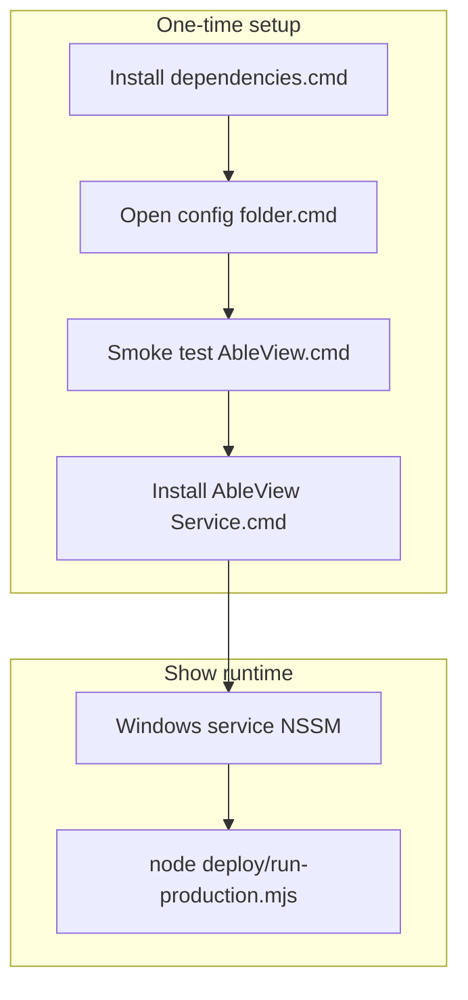

# M11 — Show-box launchers (Windows + macOS)

Build plan for **double-click / minimal-terminal** deployment on the **Windows show NUC** and
**macOS backup Ableton laptop**. Extends **M6** (deploy kit, `/health`, NSSM / LaunchAgent
scripts) — does **not** replace in-app hardening or operator browser views.

**Agent workflow:** one sub-milestone (M11a–M11e) per session/commit; **M11c (Inno) optional**.
Run `npm test` after each stage that touches repo scripts. Validate launchers on a Windows VM or
spare NUC **and** a macOS machine (or CI macOS runner for structural tests only).

**Related:** [`deploy/README.md`](../../deploy/README.md), [`deploy/RUNBOOK.md`](../../deploy/RUNBOOK.md),
M6 in [`AGENTS.md`](../../AGENTS.md), spec §4 NFR-2 (stability / auto-start).

---

## 1. Goal and non-goals

### Goal

- **Show techs without a daily terminal habit** can install and run AbleView on:
  - a **Windows NUC** using **`.cmd`** launchers (and optional Start Menu / desktop shortcuts), and
  - a **macOS backup show Mac** using **`.command`** launchers (Finder double-click → Terminal).
- **First boot path (both OSes):** install dependencies once, configure `.env` + `config.json`,
  smoke-test, register auto-start (**NSSM** on Windows, **LaunchAgent** on macOS) — each step has
  an obvious launcher with clear failure messages (missing Node, missing `.env`, health check failed).
- **Show-night path:** after service/agent install, **no terminal** for normal operation — same as
  M6. Optional launchers for manual run/debug only.
- **Linux / Pi:** thin wrappers documented only (`*.sh` + `.desktop` example); systemd unchanged.

### Platform scope (Windows vs macOS vs Linux)

| Platform | M11 default | Rationale |
|---|---|---|
| **Windows NUC** (headless show box) | **Full parity** — `.cmd` launchers, optional Inno Setup (M11c), vendored NSSM (M11b) | Primary headless deployment; M6 gap was terminal-heavy setup |
| **macOS** (backup Ableton laptop) | **Full launcher parity (M11e required)** — **`deploy/launchers/macos/*.command`** mirroring Windows steps; wraps **`deploy/install-macos.sh`** | Same show-tech UX as NUC; LaunchAgent still starts on **user login** (document vs Windows boot service) |
| **Linux / Raspberry Pi** | **Document-only** — systemd unchanged; optional **`ableview.desktop.example`** | Pi admins typically use `systemctl`; operators use browser only |

**macOS parity means `.command` scripts, not a `.app` / `.pkg`:** Gatekeeper may require
right-click → Open once; see §7 (M11e) and §10.

### Non-goals

- A single **AbleView.exe** that embeds Node + app without a install directory (possible
  follow-up if OD-D1 chooses SEA/pkg; not default v1).
- **Electron or tray GUI** for the server process.
- **Operator-facing** executables — band/lighting/visuals stay **browser URLs** only.
- Moving **`.env` secrets** into a GUI (still M7 scope gap; launchers may *open* the folder or
  Notepad, not store secrets).
- Replacing **`install-windows.ps1`** logic — wrap and call it; keep one source of truth.
- CI-built **signed** Authenticode binaries (document manual signing; automate only if maintainer
  requests).

---

## 2. Problem statement (vs current M6)

| Today (M6) | After M11 (Windows) | After M11 (macOS) |
|---|---|---|
| Node ≥ 20 installed separately | Launcher checks Node | Same via `_common.sh` |
| `npm install` in shell | **Install dependencies.cmd** | **Install dependencies.command** |
| `npm run start:production` + `/health` | **Smoke test AbleView.cmd** | **Smoke test AbleView.command** |
| Elevated `install-windows.ps1` | **Install AbleView Service.cmd** | **Install AbleView LaunchAgent.command** → `install-macos.sh` |
| No committed click-to-run artifacts | **`deploy/launchers/windows/`** (+ optional Inno) | **`deploy/launchers/macos/`** |

M6 acceptance (“power-cycle → recovers”) is unchanged: it still requires **service install once**.
M11 makes that one-time path clickable and self-explanatory.

---

## 3. Architecture

```
  SHOW BOX (Windows)
  ─────────────────
  User double-clicks
        → *.cmd / Setup.exe (optional)
        → checks cwd = install root, Node on PATH (or bundled node\)
        → npm install (first run)
        → edit .env / config\config.json (manual or “Open config folder”)
        → Smoke test → node deploy/run-production.mjs + GET /health
        → elevated NSSM via install-windows.ps1
        → Service: node deploy/run-production.mjs (unchanged)

  OPERATORS (unchanged)
  ───────────────────
  Browser → http://<host>:8080/views/...

  SHOW MAC (macOS) — M11e
  ─────────────────────
  Finder double-click → *.command
        → same logical steps as Windows
        → LaunchAgent via install-macos.sh
        → node deploy/run-production.mjs on login
```



**Constraints preserved:**

- Production entry remains **`deploy/run-production.mjs`** → `src/index.js` (NFR-1 unchanged).
- **`AppDirectory`** = install root so `.env` loading keeps working (`src/config/index.js`).
- No new outbound OSC; launcher scripts must not invoke Ableton write paths.

---

## 4. Open decisions (defaults for implementation)

Confirm with maintainer before M11c if packaging strategy differs.

| ID | Topic | Default for M11 |
|---|---|---|
| OD-D1 | Packaging strategy | **Tier A only in M11a–b:** committed `.cmd` + PowerShell helpers. **Tier B (M11c):** optional Inno Setup script producing `AbleView-Setup.exe` that copies tree + runs `npm install`. **Tier C:** Node SEA/pkg single binary — **out of scope** unless explicitly added |
| OD-D2 | Node distribution | **Require Node LTS preinstalled** for M11a; M11c may add **`deploy/portable-node/`** layout doc + installer hook to extract Node 20.x x64 alongside app |
| OD-D3 | Elevation | **Install service** launcher uses `Start-Process -Verb RunAs` wrapper or documents “Run as administrator”; smoke test stays **non-elevated** |
| OD-D4 | NSSM | **Download-on-first-install** to `deploy/tools/nssm.exe` (pinned version + checksum in repo README) **or** require NSSM on PATH — prefer **vendored copy** under `deploy/tools/` for show boxes without Chocolatey |
| OD-D5 | Shortcut targets | **`deploy/launchers/windows/`** and **`deploy/launchers/macos/`** in git; README explains Desktop aliases |
| OD-D6 | macOS parity | **Required (M11e):** **`deploy/launchers/macos/*.command`** — same step names/order as Windows; call existing **`install-macos.sh`** / **`uninstall-macos.sh`**. **Linux:** document-only + desktop example in M11d |
| OD-D7 | Sim vs production | Launchers default production; **`Run simulation mode`** pair on Windows (`.cmd`) and macOS (`.command`) |
| OD-D8 | Logs on failure | Windows `.cmd` **`pause`** on error; macOS `.command` **`read -r`** prompt + **`logs/`** + RUNBOOK pointer |

---

## 5. Launcher inventory (target)

Layout: **`deploy/launchers/windows/`** and **`deploy/launchers/macos/`** (shared
**`deploy/launchers/README.md`**). Paths relative to install root (e.g. `C:\AbleView` or
`~/AbleView`).

### Windows (`deploy/launchers/windows/`)

| Artifact | Purpose | Invokes |
|---|---|---|
| `Install dependencies.cmd` | First-time / after update | `npm install --omit=dev` |
| `Open config folder.cmd` | Open Explorer on `.env`, `config\`, `secrets\` | `explorer.exe` |
| `Smoke test AbleView.cmd` | Manual production smoke | `run-production.mjs` + `/health` |
| `Install AbleView Service.cmd` | One-time NSSM register | Elevated `deploy/install-windows.ps1` |
| `Uninstall AbleView Service.cmd` | Remove service | `deploy/uninstall-windows.ps1` |
| `Stop AbleView Service.cmd` | Show-night debug | `nssm stop` / `sc stop` |
| `Start AbleView Service.cmd` | After manual stop | `nssm start` |
| `Open admin in browser.cmd` | Convenience | `http://localhost:<port>/views/admin` |
| `Run simulation mode.cmd` | Rehearsal | `npm run sim` or `--sim` entry |

### macOS (`deploy/launchers/macos/`) — required (M11e)

| Artifact | Purpose | Invokes |
|---|---|---|
| `Install dependencies.command` | First-time / after update | `npm install --omit=dev` |
| `Open config folder.command` | Reveal `.env`, `config/`, `secrets/` in Finder | `open` |
| `Smoke test AbleView.command` | Manual production smoke | `run-production.mjs` + `/health` |
| `Install AbleView LaunchAgent.command` | One-time LaunchAgent | `deploy/install-macos.sh` |
| `Uninstall AbleView LaunchAgent.command` | Remove agent | `deploy/uninstall-macos.sh` |
| `Open admin in browser.command` | Convenience | `open http://localhost:…` |
| `Run simulation mode.command` | Rehearsal | `npm run sim` |

Optional M11c (Windows only):

| Artifact | Purpose |
|---|---|
| `deploy/installer/ableview.iss` | Inno Setup source → `AbleView-Setup.exe` |
| `deploy/installer/build-installer.ps1` | Local build script (maintainer machine) |

---

## 6. Implementation notes

### 6.1 Windows `.cmd` conventions

- **`cd /d "%~dp0..\..\.."`** from `deploy/launchers/windows/` (three levels up to repo root).
- Detect **`node.exe`** via `where node` or `%InstallDir%\node\node.exe` when portable layout exists.
- Never **`git pull`** from launchers (show boxes may not be git checkouts); support **zip copy**
  install in Inno script.

### 6.1b macOS `.command` conventions

- Resolve repo root from `deploy/launchers/macos/` (same depth as Windows).
- Scripts must be **`chmod +x`** in git (or document one-time `chmod` in README).
- Use **`open`** for Finder and admin URL; smoke test via **`curl`** against `/health`.

### 6.2 Smoke test behavior

1. Preflight: `.env` exists, `config/config.json` exists, `GOOGLE_SERVICE_ACCOUNT_KEY_PATH` file
   exists (best-effort parse like `install-windows.ps1`).
2. Start **`node deploy/run-production.mjs`** as background job or separate minimized window.
3. Poll **`http://127.0.0.1:<port>/health`** for up to 60s (cold sheet sync may return
   `503`/`degraded` — treat as **success with warning** if JSON body present).
4. Stop smoke process if launcher started it (do not stop Windows service if already registered).

### 6.3 NSSM vendoring (if OD-D4 default)

- Store **`deploy/tools/nssm-2.24/win64/nssm.exe`** (or current stable) with **SHA256** in
  `deploy/tools/README.md`.
- Update **`install-windows.ps1`** to prefer `deploy/tools/.../nssm.exe` when not on PATH
  (small M11b change — keep backward compatible).

### 6.4 Testing without a GUI agent

- **`test/deploy-launchers.test.js`**: parse **Windows `.cmd` and macOS `.command`** files — assert
  repo-root `cd`, reference `run-production.mjs`, no forbidden OSC strings.
- Manual checklist on **Windows and macOS** for service/agent install (not CI-blocking unless
  runners available).

---

## 7. Sub-milestones

### M11a — Committed `.cmd` launchers + docs

**Scope**

- Add `deploy/launchers/windows/*.cmd` per §5 (except Inno).
- Add `deploy/launchers/README.md` (order of operations, elevation, troubleshooting; macOS section stub until M11e).
- Shared helper: `deploy/launchers/windows/_common.cmd` (root detection, node check, optional pause).

**Files (expected)**

- `deploy/launchers/*`
- `deploy/README.md` — “Quick install (clickable)” section above PowerShell-only path

**Acceptance**

- Fresh Windows machine **with Node only**: double-click sequence
  **Install dependencies → Open config → Smoke test → Install service** completes without typing
  paths manually.
- Launchers fail fast with readable message if Node missing.

**Out of scope:** Inno Setup; NSSM vendoring.

**Agent prompt**

> Implement M11a per `docs/plans/M11-show-box-launchers.md` §7 (M11a): add
> `deploy/launchers/windows/` `.cmd` files and README; update `deploy/README.md`. Add
> `test/deploy-launchers.test.js` for structural checks. Run `npm test`.

---

### M11b — NSSM vendoring + install script integration

**Scope**

- Vendored NSSM under `deploy/tools/` (or documented download script run once from
  **Install dependencies**).
- `install-windows.ps1` / `uninstall-windows.ps1` resolve NSSM from vendored path first.
- **Install AbleView Service.cmd** tested with vendored NSSM (no PATH dependency).

**Acceptance**

- Service install works on machine with **no** prior NSSM install.
- Existing PATH-based NSSM still works.

**Agent prompt**

> Implement M11b per `docs/plans/M11-show-box-launchers.md` §7 (M11b): vendored NSSM +
> install script resolution. Run `npm test`.

---

### M11c — Optional Inno Setup installer (maintainer-built artifact)

**Scope**

- `deploy/installer/ableview.iss` — install to `{autopf}\AbleView` or user-chosen dir; run
  `npm install`; optionally extract bundled Node zip to `{app}\node\`.
- `deploy/installer/build-installer.ps1` — requires Inno Setup 6+ on maintainer PC.
- Document output **`AbleView-Setup.exe`** in `deploy/README.md` (not committed to git if large;
  attach to GitHub Release manually).

**Acceptance**

- Clean VM: run Setup.exe → launchers in install dir work → service install succeeds.
- Uninstall removes service (call uninstall script in `{app}\deploy`).

**Out of scope:** GitHub Actions Windows runner for Inno (unless requested).

**Agent prompt**

> Implement M11c per `docs/plans/M11-show-box-launchers.md` §7 (M11c): Inno Setup script +
> build script + docs. Do not commit built `.exe`.

---

### M11e — macOS `.command` launchers (required)

**Scope**

- `deploy/launchers/macos/*.command` — executable, **same names and order as Windows** (§5).
- Shared `deploy/launchers/macos/_common.sh` (repo root detection, `node` check).
- Extend launcher tests for macOS scripts (same forbidden-string / path rules as Windows).
- Complete **`deploy/launchers/README.md`** macOS section: Gatekeeper, `chmod +x`, first-run Open.

**Acceptance**

- On a Mac with Node 20+: double-click each step from Finder without typing `cd` paths.
- LaunchAgent install still via existing script; login-session auto-start unchanged from M6.

**Out of scope:** `.app` wrapper, Apple-notarized `.pkg`, menu-bar agent.

**Agent prompt**

> Implement M11e per `docs/plans/M11-show-box-launchers.md` §7 (M11e): macOS `.command`
> launchers mirroring Windows flow; update README and tests. Run `npm test`.

---

### M11d — Runbook, ROADMAP, cross-platform notes

**Scope**

- `deploy/RUNBOOK.md` — **Windows and macOS** clickable install checklists.
- `README.md` — one paragraph linking M11 vs M6 (both platforms).
- Optional `deploy/launchers/ableview.desktop.example` for Raspberry Pi desktop.
- Mark M11 done in `ROADMAP.md`.

**Depends on:** M11a, M11b (Windows), **M11e (macOS)** so runbook matches shipped launchers.

**Acceptance**

- Runbook matches launcher order on **both** OSes; sim rehearsal documented for `.cmd` and `.command`.

**Agent prompt**

> Implement M11d per `docs/plans/M11-show-box-launchers.md` §7 (M11d): RUNBOOK + README +
> ROADMAP. Run `npm test`.

---

## 8. Acceptance criteria (milestone M11)

Verbatim-style summary for §10-style tracking:

1. **Windows show box:** a tech can go from copied repo (or Setup.exe) to **service running** using
   only double-click launchers + Notepad/file edits for config — **no manual `cd` or npm
   typing**.
2. **macOS show Mac:** same launcher **sequence and naming** via **`.command`** files →
   **LaunchAgent** installed — **no manual `cd` or npm typing** (Terminal may open briefly per
   step).
3. **Smoke test** launchers on both OSes validate `/health` and report degraded vs ok in plain
   language.
4. **Auto-start behavior** unchanged from M6: Windows reboot → service up; macOS **login** →
   agent up (document the difference in RUNBOOK).
5. **`npm test`** includes launcher structural tests for **Windows and macOS**; NFR-1 tests still
   pass.
6. **Linux/Pi** path documented; no regression to systemd unit or underlying shell installers.

---

## 9. Rehearsal / show-night runbook (preview)

### Windows NUC

1. Copy AbleView to `C:\AbleView` (or run **AbleView-Setup.exe** if M11c built).
2. **`deploy/launchers/windows/Install dependencies.cmd`**
3. Place service account JSON in `secrets\`; edit `.env` and `config\config.json`
   (**Open config folder.cmd**).
4. **Smoke test AbleView.cmd** — confirm health response.
5. **Install AbleView Service.cmd** (admin).
6. Reboot once; confirm `http://<nuc-ip>:8080/health` from operator VLAN.

### macOS backup show Mac

1. Copy AbleView to `~/AbleView` (or chosen install dir).
2. **`deploy/launchers/macos/Install dependencies.command`** (Gatekeeper: right-click → Open if needed).
3. Place service account JSON in `secrets/`; edit `.env` and `config/config.json`
   (**Open config folder.command**).
4. **Smoke test AbleView.command**
5. **Install AbleView LaunchAgent.command**
6. Log out/in or reboot; confirm health URL; ensure show user auto-login if required (see RUNBOOK).

### Both

7. Operator view bookmarks — unchanged from M6 RUNBOOK.

**Recommended implement order:** M11a → M11b → **M11e** → M11d → M11c (optional).

---

## 10. Known limitations

- **`.cmd` files** may trigger SmartScreen / “unknown publisher” unless signed (OD-D1 Tier B).
- **Portable Node** increases install size (~50 MB+); still smaller than Electron.
- Launchers do not validate Google Sheet sharing — same as today (fail at runtime / admin).
- **WSL is unsupported** for service install; use native Windows Node.
- **macOS `.command` files** open Terminal briefly; not as polished as a notarized `.app`.
- macOS LaunchAgent runs when the **show user logs in** — not equivalent to Windows
  SERVICE_AUTO_START at boot with no login (document in RUNBOOK).

## 11. Future extensions (out of M11 scope)

- **Node SEA** single `AbleView.exe` (experimental; ESM + `googleapis` size/complexity).
- **Admin “Install service” button** calling a local helper (requires elevation bridge — high
  risk; avoid v1).
- **Auto-update** channel from GitHub Releases.
- **Chocolatey/winget** package maintained by community.

---

## 12. Effort (planning)

Indicative only — assumes familiar repo; manual checks on **Windows + macOS** for M11 sign-off.

### By sub-milestone

| Stage | Human (solo dev) | Agent-assisted (indicative) | Notes |
|---|---|---|---|
| M11a | 0.5–1 day | ~2–4 hours | Windows `.cmd` + tests + README stub |
| M11b | 0.25–0.5 day | ~2–3 hours | NSSM vendoring + script tweaks |
| M11e | 0.25–0.5 day | ~3–5 hours | **Required** — macOS `.command` parity + Gatekeeper docs |
| M11d | 2–4 hours | ~1–2 hours | RUNBOOK (both OSes), README, ROADMAP, Pi desktop example |
| M11c | 1–2 days | ~4–8 hours | **Optional** — Inno + clean VM install/uninstall |

### Roll-up scenarios

| Scope | Human (solo dev) | Agent-assisted (indicative) |
|---|---|---|
| **Default M11 ship (M11a + M11b + M11e + M11d)** — Windows + macOS clickable, vendored NSSM, no Inno | **~1.5–2.5 days** | **~8–14 hours** |
| **Windows-only shortcut (M11a + M11b + M11d, skip M11e)** | ~1–1.5 days | ~6–9 hours | **Not acceptable** — macOS parity is required |
| **Full Windows packaging (+ M11c Inno)** | add ~1–2 days | add ~4–8 hours | macOS unchanged (no Inno for Mac in v1) |

**Default milestone commitment:** **M11a, M11b, M11e, M11d** are required for ROADMAP “done”.
**M11c** remains optional unless explicitly requested.

Manual validation: budget **~3–5 hours** human time once before marking M11 done (Windows service
reboot, macOS LaunchAgent + Gatekeeper, optional Inno VM if M11c ships).

---

## 13. Milestone completion checklist

- [ ] M11a — Windows `.cmd` launchers + README + structural tests
- [ ] M11b — NSSM vendoring + install script
- [ ] M11e — macOS `.command` launchers (required)
- [ ] M11d — RUNBOOK + ROADMAP + cross-platform notes
- [ ] M11c — Inno Setup (optional)
- [ ] `ROADMAP.md` M11 marked done
- [ ] Optional: `AGENTS.md` one-line under deployment / M6 pointer to M11

---

## 14. Copy-paste agent prompts (full chain)

**Session 1 — M11a**

> Implement M11a per `docs/plans/M11-show-box-launchers.md` §7 (M11a): Windows `.cmd`
> launchers under `deploy/launchers/windows/`, update `deploy/README.md`, add
> `test/deploy-launchers.test.js`. Run `npm test`. Do not commit unless asked.

**Session 2 — M11b**

> Implement M11b per `docs/plans/M11-show-box-launchers.md` §7 (M11b): vendored NSSM under
> `deploy/tools/`, update `install-windows.ps1` / uninstall to prefer it. Run `npm test`.

**Session 3 — M11e**

> Implement M11e per `docs/plans/M11-show-box-launchers.md` §7 (M11e): macOS `.command`
> launchers under `deploy/launchers/macos/`, README Gatekeeper notes, extend launcher tests.
> Run `npm test`. Do not commit unless asked.

**Session 4 — M11d**

> Implement M11d per `docs/plans/M11-show-box-launchers.md` §7 (M11d): RUNBOOK + README + ROADMAP
> for M11 (Windows + macOS). Run `npm test`.

**Session 5 — M11c (optional)**

> Implement M11c per `docs/plans/M11-show-box-launchers.md` §7 (M11c): Inno Setup script in
> `deploy/installer/` and maintainer build script. Document release artifact; do not commit
> built exe. Run `npm test`.
