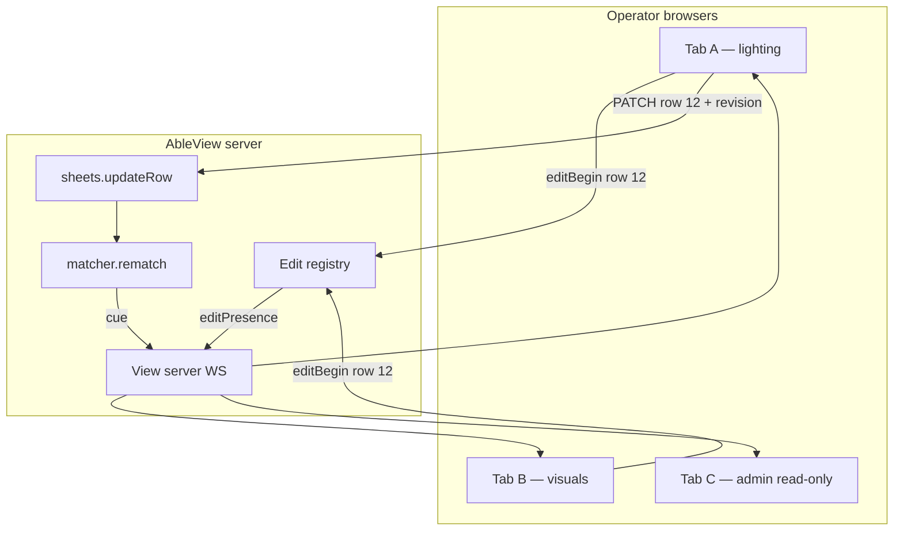

# M12 — Multi-operator edit coordination

Build plan for **safe concurrent sheet editing** when multiple operators connect to the same
AbleView server (different role views + admin). Today, edits propagate to read-only viewers after
save, but there is **no cross-client coordination** — simultaneous edits on the same row are
last-write-wins with no warning.

**Agent workflow:** one sub-milestone (M12a–M12c) per session/commit. Run `npm test` after each
stage. Validate with two browser tabs on `npm run sim` before show validation.

**Related:** M8 sheet row editor, view-scoped editor (post-v2026 in [`ROADMAP.md`](../../ROADMAP.md)),
[`public/shared/ws-client.js`](../../public/shared/ws-client.js) (client edit-session locking),
[`src/server/sheets-api.js`](../../src/server/sheets-api.js), [`AGENTS.md`](../../AGENTS.md).

---

## 1. Goal and non-goals

### Goal

- Operators on **different browsers / devices** see when someone else is editing the **same sheet
  row**, without blocking show-night workflows when roles edit **different columns**.
- A client **mid-edit** is warned when the underlying row changed elsewhere (another operator,
  admin, or Google Sheets direct edit after refresh).
- **Save conflicts** on overlapping columns are detected and surfaced; non-overlapping column saves
  still merge cleanly (preserve today's PATCH semantics).
- **Read-only viewers** continue to receive updated `CuePayload` over WebSocket within the
  existing rematch path — no regression.

### Non-goals

- Real-time collaborative editing (Google Docs–style OT/CRDT, live cursor, character-level merge).
- Authenticated per-operator identity (no login in v2026; use **view id + ephemeral client id**).
- Locking the **Google Sheet** itself or integrating Sheets "protected range" APIs.
- Preventing duplicate **create-row** submissions with server-side dedupe (warn only in M12b;
  hard dedupe is a follow-up).
- Replacing the service-account write model or adding write-back to Ableton (NFR-1 unchanged).
- Offline / split-brain editing when the server is unreachable (existing stale-cache rules apply).

---

## 2. Problem statement (current behavior)

### What works today

```
Operator A saves (PATCH)
  → sheets.updateRow (Google + in-memory snapshot)
  → onSynced → matcher.rematch()
  → EVENTS.CUE_PAYLOAD → WebSocket broadcast to all clients
  → clients NOT in editSession re-render with new row data
```

- Operator views edit **scoped columns**; admin edits the **full row**. Partial PATCH payloads
  merge at the cell level in Google Sheets.
- **Client-side edit-session locking** (per tab): while `editSession` is active, incoming `cue`
  messages update clip head / context banner only — the form is frozen at `captureEditSession`
  values.

### Gaps

| Gap | Risk on show night |
|---|---|
| No server-side edit presence | Two operators open Edit on the same row silently |
| Stale form during edit | Operator B saves old values after Operator A already saved |
| Same-column last-write-wins | No UI when lighting overwrites visuals' RGB change |
| No revision check on PATCH | Server accepts any PATCH regardless of row age |
| Periodic sheet refresh without rematch | External sheet edits invisible until clip/rematch |
| Create-row race | Two "Add cue row" clicks → duplicate sheet rows |

**Confidence today:** high for *watch-only* multi-operator; medium for *different columns, sequential
saves*; low for *same row, simultaneous edit*.

---

## 3. Architecture

### 3.1 Overview

```
  Browser tab (viewId + clientId)
       │  POST edit begin / heartbeat / end
       ▼
  Edit registry (in-memory, server)
       │  broadcast editPresence
       ▼
  All WebSocket clients
       │  show banner / disable Edit button (optional)
       │
  PATCH /api/sheets/rows/:rowId
       │  If-Match-Revision header (M12b)
       ▼
  sheets.updateRow → rematch → cue broadcast
       │  clear presence for saver
       ▼
  Non-editing clients re-render; editing clients get rowRevision bump → warning
```



### 3.2 Design principles

1. **Advisory first, enforce on save** — presence and warnings are cheap; hard locks are optional
   (M12c) because column ownership often avoids overlap.
2. **Row-scoped, not field-scoped in v1** — simpler registry; column overlap detected at save time.
3. **Ephemeral server state** — edit presence lives in memory; restart clears locks (acceptable for
   show box).
4. **Reuse WebSocket** — no second socket; presence rides the existing `/ws` connection.
5. **Minimal new config** — sensible defaults; toggles only if operators need to disable enforcement.

---

## 4. Open decisions (defaults for implementation)

| ID | Topic | Default for M12 |
|---|---|---|
| OD-E1 | Identity in presence messages | **`viewId` + random `clientId`** (UUID per tab, sent on WS connect) |
| OD-E2 | Display name in UI | **`views[viewId].title`** e.g. "Lighting"; fallback to view id |
| OD-E3 | Lock mode | **Advisory (M12a–b)**; optional **hard lock** per row via config (M12c) |
| OD-E4 | Hard lock scope | When enabled: **one editor per `rowId`** server-wide; others see read-only + banner |
| OD-E5 | Row revision source | **`snapshot.syncedAt` + hash of row data** (`revision` string on each row) |
| OD-E6 | Conflict response | **`409 Conflict`** with `{ error, serverRevision, serverRow, overlappingColumns }` |
| OD-E7 | Presence TTL | **45 s**; refreshed by client heartbeat every **15 s** while editing |
| OD-E8 | Stale warning threshold | Warn editor when **`rowRevision` advances** while `editSession` open |
| OD-E9 | Periodic refresh → views | **Call `matcher.rematch()` after successful background sync** (small related fix) |
| OD-E10 | Create-row duplicate hint | **Warn** if another client has `editBegin` with `mode: create` for same `clipName` |
| OD-E11 | Admin vs operator | Admin presence shows as **"Admin"**; same row rules apply |

---

## 5. Data contracts

### 5.1 Row revision (server)

Each row in the in-memory snapshot gains a monotonic revision token when row **data** changes:

```js
// src/sheets/revision.js (new)
export function computeRowRevision(rowData) {
  // Stable JSON sort keys; hash or fnv — fast, not crypto
  return hashStableJson(rowData);
}

// On snapshot row object:
{ rowId: '12', data: { ... }, revision: 'a1b2c3' }
```

Bump `revision` when:

- `updateRow` / `appendRow` / `appendAlias` succeeds
- Full `fetchFromGoogle` replaces row content (sync/rematch path)

Expose in API responses and `CuePayload.rowRevision` (when matched).

### 5.2 WebSocket: client → server (new message types)

Sent as JSON on the existing socket (same as future client messages if any):

**`editBegin`**

```json
{
  "type": "editBegin",
  "rowId": "12",
  "mode": "edit",
  "columns": ["BPM", "Lighting Notes"],
  "revisionAtStart": "a1b2c3"
}
```

For create mode: `rowId: null`, `mode: "create"`, include `clipName`.

**`editHeartbeat`** (every 15 s while form open)

```json
{ "type": "editHeartbeat", "rowId": "12" }
```

**`editEnd`**

```json
{ "type": "editEnd", "rowId": "12" }
```

Server validates `viewId` from connection metadata (already parsed on connect). Unknown types →
ignore with debug log.

### 5.3 WebSocket: server → clients

**`editPresence`** (broadcast to all clients; admin may receive extended detail)

```json
{
  "type": "editPresence",
  "editors": [
    {
      "clientId": "uuid-a",
      "viewId": "lighting",
      "viewTitle": "Lighting",
      "rowId": "12",
      "mode": "edit",
      "columns": ["BPM", "Lighting Notes"],
      "since": "2026-07-27T22:15:00.000Z"
    }
  ]
}
```

On connect, include current `editors` in **`init`** payload (`init.editors`).

**`rowRevision`** (optional dedicated message, or rely on `cue` payload — prefer **`cue`**)

Add to matched `CuePayload`:

```json
{
  "clipName": "Song A",
  "match": { "matched": true, "rowId": "12", ... },
  "row": { ... },
  "rowRevision": "d4e5f6"
}
```

### 5.4 REST: optimistic concurrency (M12b)

**Request**

```
PATCH /api/sheets/rows/12
If-Match-Revision: a1b2c3
Content-Type: application/json

{ "BPM": "128" }
```

Also accept body field `"_revision": "a1b2c3"` for fetch clients that cannot set headers easily.

**Success `200`**

```json
{
  "ok": true,
  "rowId": "12",
  "row": { ... },
  "revision": "d4e5f6",
  "syncedAt": "...",
  "stale": false
}
```

**Conflict `409`**

```json
{
  "ok": false,
  "error": "row changed since edit started",
  "rowId": "12",
  "serverRevision": "d4e5f6",
  "clientRevision": "a1b2c3",
  "overlappingColumns": ["BPM"],
  "row": { ... }
}
```

**Overlap rule:** conflict if `serverRevision !== clientRevision` **and** intersection of PATCH
columns with columns changed since `clientRevision` is non-empty. If client revision stale but
PATCH touches **disjoint** columns, **allow** merge (200).

For M12b v1, simpler alternative (document both; implement **simple revision match** first):

- **Strict:** any revision mismatch → 409 (easier; may false-positive on disjoint edits).
- **Smart (recommended):** store `lastRevision` per row + diff columns since that revision in
  snapshot metadata, or re-fetch row from snapshot at save and compare field-by-field for overlap.

Start with **strict revision match** in M12b; upgrade to smart overlap in M12b.1 if false
positives annoy operators.

### 5.5 Client UI states

| State | Operator view (not editing) | Operator mid-edit |
|---|---|---|
| No other editors | Normal | Normal form |
| Other editor, same row | Banner: "Visuals is editing this cue" | Banner + optional "Reload row" |
| Row revision advanced | Re-render via `cue` (unchanged) | Sticky warning: "Row updated elsewhere — review before save" |
| Save 409 | N/A | Modal: show server values; **Reload** or **Overwrite** (Overwrite sends force flag — optional M12c) |

**Hard lock (M12c, when `sheets.editLockMode: "enforce"`):** hide Edit button for other clients
on the same `rowId`; server rejects `editBegin` with `editDenied` message.

---

## 6. Server module design

### 6.1 `src/server/edit-registry.js` (new)

In-memory map:

```js
// key: `${rowId}` for edit; key: `create:${clipName}` for create sessions
{
  rowId: '12',
  clientId, viewId, viewTitle,
  mode: 'edit' | 'create',
  columns: string[],
  revisionAtStart: string | null,
  clipName: string | null,  // create mode
  lastHeartbeat: ISO8601,
}
```

| Method | Behavior |
|---|---|
| `register(client, payload)` | Upsert editor; prune expired (> TTL) |
| `unregister(client, rowId)` | Remove on editEnd / disconnect |
| `getEditors()` | Snapshot for broadcast |
| `getEditorsForRow(rowId)` | Filter |
| `pruneExpired()` | Called on timer (30 s) |

On **WebSocket close**: remove all entries for that `clientId`.

On **successful PATCH/POST** from client: remove that client's presence for the row.

### 6.2 Wire into `src/server/index.js`

- Parse `clientId` from WS query `?view=lighting&clientId=...` or generate server-side on connect
  and return in `init.clientId`.
- Handle incoming WS messages: `editBegin`, `editHeartbeat`, `editEnd`.
- After registry change → `broadcast({ type: 'editPresence', editors })`.
- Pass `editRegistry` into sheets route handlers if needed for hard lock checks.

### 6.3 Wire into `src/sheets/index.js`

- Track `revision` on each row object.
- `updateRow`: accept optional `expectedRevision`; throw `RowRevisionConflictError` with details.
- After `fetchFromGoogle` in background sync: invoke optional `onSyncComplete` callback →
  `matcher.rematch()` (OD-E9).

### 6.4 `src/match/index.js`

- Include `rowRevision` on matched payloads from snapshot row.

---

## 7. Client module design

### 7.1 `public/shared/ws-client.js`

- Generate/store `clientId` in `sessionStorage`.
- On `startEdit` / `startCreate`: send `editBegin`; store `revisionAtStart` from
  `lastPayload.rowRevision`.
- Interval heartbeat while `editSession` active.
- On `cancelEdit` / successful `saveEdit`: send `editEnd`.
- Handle `editPresence`: store `otherEditors`; pass to render.
- Handle `rowRevision` change while editing: set `editStaleWarning = true` if
  `revision !== editSession.revisionAtStart`.
- On save: send `If-Match-Revision` (or `_revision` body); handle 409 UI.

### 7.2 `public/shared/view-render.js` + `admin-row-editor.js`

- **Presence banner** below clip head when `otherEditors` shares current `rowId`.
- **Stale edit banner** in editor panel (reuse `admin-editor-context` area).
- **409 dialog** component (minimal: list overlapping columns, Reload / Cancel).

### 7.3 Save path improvement (included in M12a)

After successful PATCH, apply `body.row` + `body.revision` to local render immediately instead of
waiting for WS `cue` — reduces flash of stale read mode.

---

## 8. Configuration

Add to `config/config.example.json` and `DEFAULTS`:

```json
{
  "sheets": {
    "editPresenceEnabled": true,
    "editPresenceTtlSeconds": 45,
    "editLockMode": "advisory",
    "editRequireRevision": false
  }
}
```

| Key | Default | Notes |
|---|---|---|
| `editPresenceEnabled` | `true` | Master toggle for M12 features |
| `editPresenceTtlSeconds` | `45` | Stale presence auto-clear |
| `editLockMode` | `"advisory"` | `"advisory"` \| `"enforce"` (M12c) |
| `editRequireRevision` | `false` | When `true`, PATCH without revision → 400 (M12b+) |

Do **not** add to admin settings form in M12 (edit `config.json` on show box); optional M12d.

---

## 9. Build stages

### M12a — Edit presence + stale warning + save response apply

**Scope**

- Server edit registry + WS `editBegin` / `editHeartbeat` / `editEnd` / `editPresence`.
- `rowRevision` on snapshot rows and matched `CuePayload`.
- Client presence banner; stale warning when `rowRevision` changes during edit.
- Apply PATCH response row immediately on save.
- Background sheet sync triggers rematch (OD-E9).

**Files (expected)**

- `src/server/edit-registry.js`
- `src/sheets/revision.js`
- `src/server/index.js` — WS message handling, init.editors
- `src/sheets/index.js` — revision bumps, onSyncComplete hook
- `src/match/index.js` — `rowRevision` on payload
- `src/index.js` — wire rematch on background sync
- `public/shared/ws-client.js`
- `public/shared/view-render.js`
- `public/shared/styles.css` — presence/warning banners
- `test/edit-registry.test.js`
- `test/row-revision.test.js`

**Acceptance**

- Tab A opens Edit on row 12 → Tab B shows "Lighting is editing this cue" within one WS RTT.
- Tab A saves → presence clears; Tab B shows updated field values.
- Tab A editing; Tab B saves same row → Tab A sees stale warning before save.
- Background sync updates row → all non-editing clients update; editing client sees warning.
- `npm test` green; NFR-1 untouched.

**Agent prompt**

> Implement M12a per `docs/plans/M12-multi-operator-edit-coordination.md` §9 (M12a): edit
> registry, WS presence, rowRevision on cue payload, client banners and stale warning, rematch on
> background sync. Tests for registry TTL and revision bump. Run `npm test`.

---

### M12b — Optimistic concurrency on PATCH

**Scope**

- `If-Match-Revision` / `_revision` on PATCH (and optionally POST append).
- 409 response shape; client conflict dialog with Reload.
- Config `editRequireRevision` (default false).

**Files (expected)**

- `src/sheets/index.js` — revision check in `updateRow`
- `src/server/sheets-api.js` — map conflict to 409
- `public/shared/ws-client.js` — send revision, handle 409
- `test/sheets-api.test.js` — conflict cases
- `test/sheets-update.test.js` — revision mismatch throws

**Acceptance**

- Client sends stale revision → 409 with server row.
- Client sends current revision → 200, revision increments.
- With `editRequireRevision: true`, missing revision → 400.
- `npm test` green.

**Agent prompt**

> Implement M12b per `docs/plans/M12-multi-operator-edit-coordination.md` §9 (M12b):
> optimistic concurrency on row PATCH, 409 handling in ws-client, tests.

---

### M12c — Hard lock mode (optional)

**Scope**

- `sheets.editLockMode: "enforce"` → server rejects second `editBegin` on same row.
- WS `editDenied` to client; Edit button hidden/disabled on other tabs.
- Optional `force: true` on PATCH for admin break-glass (config-gated, off by default).

**Acceptance**

- Enforce mode: only one editor per row; second tab gets clear message.
- Advisory mode unchanged (default).

---

### M12d — Admin settings + runbook (optional polish)

- Surface presence toggles on admin settings (if added to `EDITABLE_SECTIONS`).
- Operator runbook paragraph in `deploy/RUNBOOK.md`.
- Update `ROADMAP.md` post-v2026 row.

---

## 10. Operator runbook (after M12a+)

1. **Role split:** Prefer each department editing its own columns (lighting → BPM/notes, visuals →
   RGB) — overlaps become rare.
2. **If you see "X is editing this cue":** wait or coordinate on comms before editing the same row.
3. **If you see "Row updated elsewhere":** tap Reload to refresh the form before saving.
4. **After a 409 on save:** choose Reload (safe) — do not mash Save repeatedly.
5. **Admin wins disputes:** admin can use enforce mode or direct Google Sheet edit + manual sync.

---

## 11. Testing checklist

| Test | File |
|---|---|
| Registry register / unregister / TTL prune | `test/edit-registry.test.js` |
| WS disconnect clears presence | `test/edit-registry.test.js` or server integration |
| `computeRowRevision` stable / changes on data change | `test/row-revision.test.js` |
| PATCH with matching revision succeeds | `test/sheets-api.test.js` |
| PATCH with stale revision → 409 | `test/sheets-api.test.js` |
| rematch after background sync | `test/sheets-*.test.js` or integration |
| Client: presence banner when otherEditors (optional jsdom) | `test/row-editor.test.js` extend |

Manual QA (two tabs):

1. Same view, same row — both Edit → both see presence.
2. Save in tab A — tab B read mode updates; tab A editor clears.
3. Tab A editing; tab B saves — tab A warning appears.

---

## 12. Future extensions (out of M12 scope)

- **Field-scoped locks** — `"Visuals is editing RGB_1"` with column-granular registry.
- **Smart merge on 409** — three-way merge UI for non-overlapping column subsets.
- **Create-row dedupe** — server rejects second append with same `matchColumn` value within N seconds.
- **Session log `sheet_edit` events** — who changed what (pairs with M10 §12).
- **Authenticated operator names** — if admin gains auth later.

---

## 13. Known limitations

- Presence is **in-memory** — server restart clears all editors; clients must re-send heartbeat.
- **No Google Sheets push notification** — external sheet edits appear after refresh interval or
  manual sync (M12a rematch-on-sync mitigates, not instant).
- **Identity is spoofable** — any browser can claim any view id; trust model is same as today
  (LAN/show network).
- **Strict revision check** may block valid disjoint saves until smart overlap lands.
- **Create mode** has no `rowId` until save — presence keyed by clip name only.

---

## 14. Effort (planning)

| Stage | Agent-assisted (indicative) |
|---|---|
| M12a | ~4–6 hours |
| M12b | ~2–3 hours |
| M12c | ~2 hours |
| M12d | ~1 hour |
| **Total** | ~1.5–2 days |

---

## 15. Milestone completion checklist

- [ ] M12a — presence, rowRevision, stale warning, rematch-on-sync
- [ ] M12b — PATCH revision / 409 conflict
- [ ] M12c — enforce lock mode (optional)
- [ ] M12d — runbook + ROADMAP (optional)
- [ ] `ROADMAP.md` updated when shipped

---

## 16. Copy-paste agent prompts (full chain)

**Session 1 — M12a**

> Implement M12a per `docs/plans/M12-multi-operator-edit-coordination.md` §9 (M12a): server edit
> registry, WebSocket presence protocol, rowRevision on cue payload, client presence/stale banners,
> apply PATCH response on save, rematch after background sheet sync. Add tests. Run `npm test`. Do
> not commit unless asked.

**Session 2 — M12b**

> Implement M12b per `docs/plans/M12-multi-operator-edit-coordination.md` §9 (M12b): optimistic
> concurrency on PATCH with If-Match-Revision, 409 conflict responses, client Reload dialog.
> Run `npm test`.

**Session 3 — M12c (optional)**

> Implement M12c per `docs/plans/M12-multi-operator-edit-coordination.md` §9 (M12c): enforce
> edit lock mode in config, editDenied WS message, admin break-glass force PATCH. Run `npm test`.
