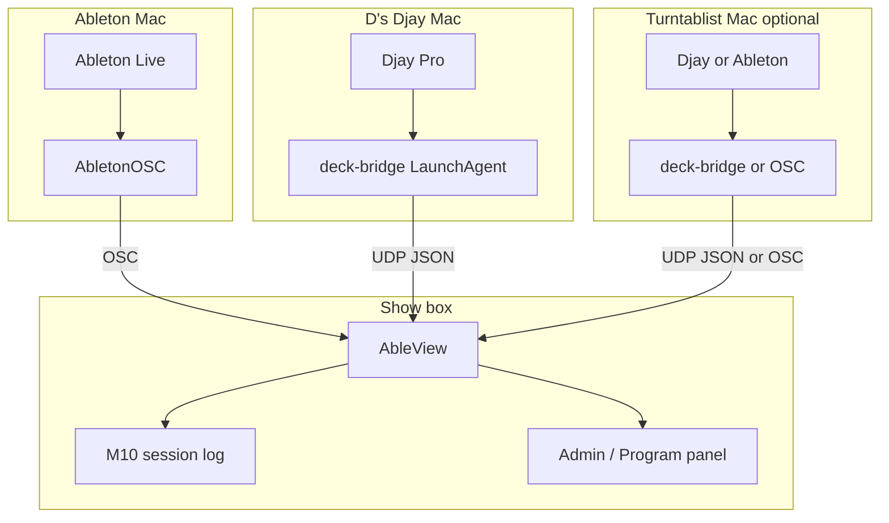

# M13 — External deck monitor (Djay Pro + multi-Mac program sources)

Build plan for **live deck visibility** from performer Macs running **Algoriddim djay Pro**
(alongside the existing Ableton cue pipeline). Operators see **loaded tracks on every deck**,
with **on-air** status highlighted. **On-air transitions only** append to the M10 session log
when logging is enabled.

**Agent workflow:** one sub-milestone (M13a–M13e) per session/commit. Run `npm test` after each
stage. Prototype bridge → ingest on a LAN with two Macs before show validation.

**Related:** M10 session cue log ([`M10-session-cue-log.md`](./M10-session-cue-log.md)),
[`ableview_spec_from_claude.md`](../../ableview_spec_from_claude.md) §11 (extension points),
[`src/core/bus.js`](../../src/core/bus.js), [`deploy/install-macos.sh`](../../deploy/install-macos.sh),
[djay-pro-bridge](https://github.com/kyleawayan/djay-pro-bridge) (community reference).

---

## 1. Goal and non-goals

### Goal

- **Alongside Ableton, not replacing it.** Ableton + sheet matching remain the primary cue lane
  (`authoritativeClip` / `CUE_PAYLOAD`). External decks are a separate **program monitor** lane.
- Support **multiple performer Macs** on the LAN, each reporting deck state to the AbleView show box:
  - **D — Djay Pro** (primary target; macOS)
  - **Turntablist Mac** (optional third machine; same bridge if Djay, or AbletonOSC adapter if
    sample rig — see §12 OD-D3)
- Operators see, per configured source:
  - **Loaded** track (title / artist) on every deck, even when paused
  - **Playing** transport state (secondary indicator)
  - **On-air** — audible through the program mix (primary highlight)
- **Set-and-forget ops** on each performer Mac: one-time LaunchAgent install + Accessibility
  grant; no nightly “start the bridge” step (parity with AbletonOSC’s install-once model).
- When M10 session logging is **enabled**, append **`deck_on_air`** JSONL events **only** when
  on-air identity changes — not on load-only or preview/headphone activity.

### Non-goals

- Replacing Ableton as authoritative cue source or fuzzy-matching DJ track titles against the
  sheet by default (optional follow-up only if explicitly requested).
- **Write-back** to Djay or Ableton (NFR-1 unchanged on Ableton side).
- Official Algoriddim API (none exists today); no dependency on Djay shipping OSC/WebSocket.
- **iOS / iPad Djay** as bridge host (Accessibility path is macOS-only for v1).
- **Windows** Djay bridge in v1 (macOS-first; Windows SQLite polling documented as future path).
- High-frequency position logging (elapsed ms) in session log — on-air **metadata** only.
- Turntablist **vinyl / no-metadata** rigs without a software title (see §12 OD-D3).

---

## 2. Problem statement

| Platform | Live deck metadata | Set-and-forget |
|---|---|---|
| **Ableton + AbletonOSC** | Documented read-only OSC | Remote Script install once |
| **Djay Pro** | No OSC / Pro DJ Link / plugin SDK | Community macOS Accessibility readers only |
| **Show need** | Loaded + on-air across 2–3 Macs | LaunchAgent per machine; show box aggregates |

Djay is the only major DJ platform without machine-readable live output (community feature
requests ongoing). The practical v1 path is a **small native bridge** on each Djay Mac (adapt
[djay-pro-bridge](https://github.com/kyleawayan/djay-pro-bridge)), pushing JSON over UDP to
AbleView on the show box.

---

## 3. Architecture

### 3.1 Topology



### 3.2 Two lanes on the event bus

| Lane | Bus event | Matcher | Operator purpose |
|---|---|---|---|
| **Cue** | `NOW_PLAYING` → `CUE_PAYLOAD` | Yes | Sheet-backed cue notes (Ableton) |
| **Program** | `PROGRAM_DECK_STATE` (new) | No | External loaded / playing / on-air |

Keep **`NowPlaying`** and **`CuePayload`** contracts stable (spec §9). Program state is a
**parallel contract** — downstream matcher must not subscribe.

### 3.3 Sidecar vs in-process bridge

| Location | Bridge runs | Why |
|---|---|---|
| **Performer Mac** (D, turntablist) | **`ableview-deck-bridge`** LaunchAgent | Accessibility is local to the Djay UI process |
| **Show box** | UDP **listener + aggregator** inside AbleView | Single admin/WS fan-out point |

Do **not** require operators to run Terminal / `swift run` nightly.

---

## 4. Data contracts

### 4.1 Bridge → show box: `DeckBridgeReport` (UDP JSON)

One datagram per report (or per deck if size limits bite — prefer one payload):

```json
{
  "schemaVersion": 1,
  "sourceId": "djay-d",
  "reportedAt": "2026-08-11T02:15:04.512Z",
  "bridgeVersion": "0.1.0",
  "app": { "name": "djay-pro", "running": true },
  "crossfader": 0.35,
  "decks": [
    {
      "deckIndex": 1,
      "loaded": {
        "title": "What It Sounds Like (AWAIAN Remix)",
        "artist": "HUNTR/X, EJAE, …"
      },
      "playing": true,
      "onAir": true,
      "bpm": 124.0,
      "bpmPercent": 0.0,
      "key": "e minor",
      "elapsedDisplay": "01:35"
    },
    {
      "deckIndex": 2,
      "loaded": { "title": "My Way (Remix)", "artist": "KATSEYE" },
      "playing": false,
      "onAir": false,
      "bpm": 128.0,
      "bpmPercent": 0.0,
      "key": "e flat",
      "elapsedDisplay": null
    }
  ]
}
```

- **`loaded`**: present when title visible in UI; `null` when deck empty.
- **`playing`**: transport running (bridge applies debounce — see djay-pro-bridge ~700ms play
  detection).
- **`onAir`**: computed on bridge from crossfader + per-deck line volume (§6.2).
- **`sourceId`**: stable config id; must match `externalSources[].id` on show box.

### 4.2 Show box internal: `ProgramDeckState` (bus)

Aggregated snapshot after ingest validation:

```json
{
  "timestamp": "2026-08-11T02:15:04.520Z",
  "sources": [
    {
      "id": "djay-d",
      "label": "D",
      "live": true,
      "lastSeenAt": "2026-08-11T02:15:04.512Z",
      "stale": false,
      "decks": [ "…DeckBridgeReport.decks…" ]
    }
  ]
}
```

Emit `EVENTS.PROGRAM_DECK_STATE` when any source’s meaningful fingerprint changes (§6.3).

### 4.3 M10 extension: `event: "deck_on_air"` (JSONL)

Append **only** when on-air identity changes while logging enabled (`sessionLog.logExternalOnAir
=== true`):

```json
{
  "timestamp": "01:23:45:12",
  "timestampSource": "artnet",
  "loggedAt": "2026-08-11T02:15:04.520Z",
  "event": "deck_on_air",
  "sourceId": "djay-d",
  "sourceLabel": "D",
  "deckIndex": 1,
  "title": "What It Sounds Like (AWAIAN Remix)",
  "artist": "HUNTR/X, EJAE, …",
  "bpm": 124.0,
  "key": "e minor",
  "previousOnAir": {
    "sourceId": "djay-d",
    "deckIndex": 2,
    "title": "My Way (Remix)"
  },
  "tempo": 128,
  "beat": 12,
  "simulated": false,
  "sessionName": "show-night-1"
}
```

**Log policy:**

| Transition | Log? |
|---|---|
| Deck becomes on-air (was not) | Yes |
| On-air deck’s loaded title changes | Yes |
| Load to inactive deck | No |
| Play in headphones / preview, not on-air | No |
| Crossfader tweak, same on-air deck | No (hysteresis — §6.2) |
| Source goes stale / bridge offline | No line (optional `deck_on_air_clear` follow-up) |

Reuse M10 `resolveLogTimestamp(getTimecodeStatus())` envelope.

---

## 5. Configuration

### 5.1 Show box — `config.json`

```json
{
  "externalSources": [
    {
      "id": "djay-d",
      "label": "D",
      "type": "deck-bridge-udp",
      "listenPort": 9101,
      "staleMs": 3000,
      "expectedDecks": 2
    },
    {
      "id": "tt-samples",
      "label": "Turntables",
      "type": "deck-bridge-udp",
      "listenPort": 9102,
      "staleMs": 3000,
      "expectedDecks": 2
    }
  ],
  "sessionLog": {
    "logExternalOnAir": true
  }
}
```

- **`listenPort`**: unique per source on show box; bridge on performer Mac sends to
  `{showBoxHost}:{listenPort}`.
- **`staleMs`**: no UDP received → `live: false`, admin shows stale badge.
- **`type`**: v1 only `deck-bridge-udp`; future `abletonosc-remote` for turntablist Ableton rig.

### 5.2 Performer Mac — bridge config (committed example)

`deploy/deck-bridge/config.example.json`:

```json
{
  "sourceId": "djay-d",
  "targetHost": "192.168.1.50",
  "targetPort": 9101,
  "reportIntervalMs": 100,
  "onAir": {
    "crossfaderThreshold": 0.08,
    "lineVolumeMin": 0.05
  }
}
```

Install via **`deploy/install-deck-bridge-macos.sh`** → LaunchAgent
`com.ableview.deck-bridge.{sourceId}`.

---

## 6. On-air detection

### 6.1 Inputs (from Accessibility tree)

Per djay-pro-bridge: title, artist, key, BPM, play/pause, **crossfader** slider, **line volume**
per deck.

### 6.2 Algorithm (v1 default)

1. Normalize crossfader `0..1` (0 = full deck 1, 1 = full deck 2).
2. Assign **weight** per deck from crossfader position (soft split near center).
3. Deck is **on-air** if `weight >= threshold` **and** `lineVolume >= lineVolumeMin`.
4. Apply **hysteresis** (e.g. 50–100ms hold) so minor crossfader motion does not flip UI/log.

Document recommended Djay UI layout (jog view, timer visible) in deploy README — some AX fields
are view-dependent.

### 6.3 Dedupe (AbleView aggregator)

Fingerprint per source:

```js
JSON.stringify(decks.map(d => ({
  deckIndex: d.deckIndex,
  loadedTitle: d.loaded?.title ?? null,
  playing: d.playing,
  onAir: d.onAir,
})))
```

Emit bus event when fingerprint changes. Session logger maintains separate
`lastOnAirKey = { sourceId, deckIndex, loadedTitle }` for `deck_on_air` append policy.

---

## 7. Module design

### 7.1 New / touched modules

| Module | Path | Role |
|---|---|---|
| Deck bridge (Swift) | `bridge/deck-bridge/` | macOS AX reader + UDP sender; fork/adapt djay-pro-bridge |
| Bridge installer | `deploy/install-deck-bridge-macos.sh` | LaunchAgent + Accessibility instructions |
| Program ingest | `src/program/` | UDP listeners, validate, aggregate, stale sweep |
| Bus | `src/core/bus.js` | Add `EVENTS.PROGRAM_DECK_STATE` |
| View server | `src/server/index.js` | WS push program state; admin health |
| Session log | `src/session-log/index.js` | Optional `deck_on_air` handler (M13e) |
| Admin UI | `public/shared/admin-program.js` | Program Sources panel |
| Config | `src/config/index.js` | `externalSources`, `sessionLog.logExternalOnAir` |

### 7.2 `createProgramIngest({ getConfig, bus, log })`

- Bind one UDP socket per configured `listenPort` (or single socket demux by port — implementation
  choice).
- Validate `schemaVersion`, `sourceId` matches config entry.
- Update in-memory map `sourceId → last report`.
- Interval timer marks sources stale when `now - lastSeenAt > staleMs`.
- Emit aggregated `ProgramDeckState` on meaningful change.

### 7.3 WebSocket

- Include `program: { sources: [...] }` in admin `init` and on `PROGRAM_DECK_STATE`.
- Optional: dedicated **`program`** operator view in config (post-M13c follow-up) or admin-only
  v1.

### 7.4 Health

Extend `/health` / admin status:

```json
{
  "program": {
    "sources": [
      { "id": "djay-d", "live": true, "lastSeenAt": "…", "stale": false }
    ]
  }
}
```

Cue lane health unchanged when all program sources offline.

---

## 8. Operational model (show night)

| Machine | One-time setup | Operator nightly |
|---|---|---|
| Show box | AbleView LaunchAgent (M6/M11) | Nothing |
| Ableton Mac | AbletonOSC Remote Script | Open Ableton |
| D's Djay Mac | deck-bridge LaunchAgent + Accessibility | Open Djay |
| Turntablist Mac | deck-bridge or AbletonOSC | Open their app |

Bridge **auto-starts at login**; when Djay is closed, reports `app.running: false` and empty
decks — no crash loop. When Djay opens, next poll resumes.

**Failure mode:** program panel goes stale; **Ableton cue notes keep working**.

---

## 9. Build order (sub-milestones)

### M13a — Deck bridge sidecar (macOS)

- Swift package under `bridge/deck-bridge/` (Reader core from djay-pro-bridge pattern).
- UDP JSON reports to configurable host/port.
- On-air computation + play debounce.
- `deploy/install-deck-bridge-macos.sh` + `config.example.json` + README section.
- **Accept:** bridge runs as LaunchAgent; with Djay open, `nc -u -l` on show box receives reports;
  Accessibility grant documented.

### M13b — Program ingest on show box

- `src/program/` UDP listener(s), validation, stale detection, bus emit.
- Config validation for `externalSources`.
- Unit tests with injected UDP payloads.
- **Accept:** two source ids on two ports aggregate independently; stale after silence.

### M13c — Admin Program Sources UI

- Panel on admin (or settings) showing all sources/decks: loaded title, playing, **ON AIR** badge.
- WebSocket live updates.
- **Accept:** sim fixture or recorded JSON drives UI in test; manual LAN demo with M13a bridge.

### M13d — Bridge packaging + turntablist doc path

- Second LaunchAgent profile example (`tt-samples`).
- Document turntablist alternatives (§12 OD-D3): Djay = same bridge; Ableton samples =
  remote AbletonOSC watched tracks (future `type`).
- **Accept:** install script works for two source ids on one Mac (dev) or two Macs (show).

### M13e — Session log `deck_on_air` (extends M10)

- Config `sessionLog.logExternalOnAir` (default `true` when external sources configured? **Default
  `false`** until operator opts in — see OD-D5).
- Subscribe to program state; append on on-air transitions only.
- Tests in `test/session-log-deck-on-air.test.js`.
- Update M10 plan §12 cross-reference.
- **Accept:** load-to-deck B does not log; crossfade B on-air logs one line with Art-Net timestamp
  when live.

---

## 10. Testing strategy

| Area | Tests |
|---|---|
| UDP payload validation | `test/program-ingest.test.js` |
| On-air hysteresis | Bridge unit tests (Swift) + ingest fingerprint tests |
| Stale source | ingest timer marks `live: false` |
| WS admin init | extend `test/server.test.js` |
| `deck_on_air` dedupe | `test/session-log-deck-on-air.test.js` |
| NFR-1 | No new Ableton write paths; program ingest is inbound-only |

Manual: two Macs on LAN, Djay load + crossfade, admin panel + JSONL tail.

---

## 11. Security and privacy

- UDP is **unauthenticated LAN** traffic (same trust model as AbletonOSC on show VLAN).
- Optional v2: HMAC shared secret in bridge + show box config.
- Accessibility permission is **per bridge binary** — document in deploy README.
- Do not log streaming DRM URIs or file paths unless needed (title/artist sufficient for v1).

---

## 12. Open decisions

| ID | Topic | Default for M13 |
|---|---|---|
| OD-D1 | Bridge language | **Swift** (reuse djay-pro-bridge AX code); Node cannot read macOS AX natively |
| OD-D2 | Report rate | **100ms** UDP send; AX poll ~8fps internally |
| OD-D3 | Turntablist Mac software | **Assume Djay** until confirmed; document AbletonOSC remote as M13d alt |
| OD-D4 | Operator visibility | **Admin-only** v1; optional `views.program` in follow-up |
| OD-D5 | Default `logExternalOnAir` | **`false`** in example config; enable per show in settings |
| OD-D6 | Windows Djay | **Out of scope v1**; note SQLite polling (djay-connect) as future milestone |
| OD-D7 | Match DJ titles to sheet | **No** in M13; program lane is display + on-air log only |

---

## 13. Known limitations

- Djay UI changes may break AX element labels — monitor bridge version per Djay major release.
- On-air is **heuristic** (crossfader + fader), not audio-sidechain truth.
- Apple Music / streaming titles may not match internal sheet naming if match is ever added later.
- iPad Djay cannot host the bridge.
- Elapsed time sub-second accuracy not required for v1 program panel.

---

## 14. Effort (planning)

| Stage | Indicative |
|---|---|
| M13a bridge + installer | 1–2 days |
| M13b ingest | 0.5–1 day |
| M13c admin UI | 0.5–1 day |
| M13d docs / second source | 0.25 day |
| M13e session log | 0.5 day |
| **Total** | **~3–5 days** |

---

## 15. Milestone completion checklist

- [ ] M13a — macOS deck-bridge LaunchAgent
- [ ] M13b — program UDP ingest + bus
- [ ] M13c — admin Program Sources UI + WS
- [ ] M13d — multi-source deploy docs + turntablist path
- [ ] M13e — `deck_on_air` session log events
- [ ] `ROADMAP.md` M13 marked done
- [ ] `AGENTS.md` module table updated

---

## 16. Copy-paste agent prompts

**Session 1 — M13a**

> Implement M13a per `docs/plans/M13-external-deck-monitor.md` §9 (M13a): Swift deck-bridge
> under `bridge/deck-bridge/`, UDP JSON reports, on-air heuristic, macOS LaunchAgent install
> script. Adapt patterns from djay-pro-bridge. No AbleView ingest yet. Document Accessibility
> setup in `deploy/README.md`. Do not commit unless asked.

**Session 2 — M13b**

> Implement M13b per `docs/plans/M13-external-deck-monitor.md` §9 (M13b): `src/program/` UDP
> ingest, `EVENTS.PROGRAM_DECK_STATE`, config `externalSources`, tests. Wire in `src/index.js`.
> Run `npm test`. Do not commit unless asked.

**Session 3 — M13c**

> Implement M13c per `docs/plans/M13-external-deck-monitor.md` §9 (M13c): admin Program Sources
> panel, WebSocket push, health status. Run `npm test`. Do not commit unless asked.

**Session 4 — M13e**

> Implement M13e per `docs/plans/M13-external-deck-monitor.md` §9 (M13e): `deck_on_air` JSONL
> events, `sessionLog.logExternalOnAir`, tests. Run `npm test`. Do not commit unless asked.
