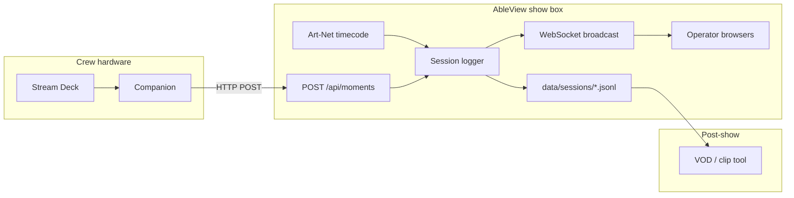

# M14 — Moments (crew Stream Deck markers)

Build plan for **human-in-the-loop show markers** — crew and band members tap a Stream Deck
button (via **Bitfocus Companion**) to stamp **SMPTE-aligned moments** into the active **session
log** JSONL. A separate VOD/post tool consumes the same file alongside video to generate clips,
start conversations, etc.

Working title for the first button: **"dope"** (`kind: "dope"`). The contract is generic so
additional kinds (e.g. **`not_dope`**) are config + Companion buttons, not a schema change.

**Agent workflow:** one sub-milestone (M14a–M14d) per session/commit. Run `npm test` after each
stage. Validate with `npm run sim` + Companion **Generic HTTP Requests** before show validation.

**Related:** M10 session cue log ([`M10-session-cue-log.md`](./M10-session-cue-log.md)),
[`src/session-log/`](../../src/session-log/), [`ROADMAP.md`](../../ROADMAP.md),
[`AGENTS.md`](../../AGENTS.md).

---

## 1. Goal and non-goals

### Goal

- **Companion → AbleView HTTP** — one press appends a **`moment`** line to the **same session
  JSONL** as `track_clip`, `match`, and `launch` events (M10).
- Each moment includes an **SMPTE-style timestamp** via existing `resolveLogTimestamp()` (Art-Net
  when live; wall-clock fallback when not).
- **Expandable kinds** — v1 ships **`dope`**; config allowlist accepts future kinds
  (`not_dope`, `flag`, …) without API redesign.
- **Optional identity** — `who` (e.g. `"keys"`, `"bass"`, `"deck-2"`) is set per Companion button
  in the JSON body; omit when anonymous is fine.
- **Auto-start session log on first moment** — when logging is off, the first accepted moment tap
  enables logging, creates a **timestamp-based session name**, writes the moment, and **broadcasts**
  the new session title to all connected browser views (no refresh).
- **Companion setup doc** — copy-paste recipe using built-in **Generic HTTP Requests** (no custom
  module required for v1).

### Non-goals

- **Custom Bitfocus Companion module** in v1 (follow-up for dropdown kinds, connection-level
  `who`, reliable button feedback variables).
- **OSC ingress** for moments (Ableton OSC path stays read-only; NFR-1 unchanged).
- **Separate moments-only export file** — filter `event == "moment"` from session JSONL.
- **Authenticated API** — LAN trust boundary same as existing `/api/*` (settings, sheets).
- **Operator browser UI** for *pressing* moments (hardware buttons only in v1).
- **Renaming an already-active session** on moment tap — auto-start naming applies only when logging
  was **off** at press time; an enabled session keeps its current name.
- **Rich notes UI** — optional short `note` string in JSON body only; no Stream Deck text entry in v1.

---

## 2. Problem statement

### What exists (M10)

- Append-only session JSONL under `data/sessions/<name>.jsonl`.
- Automatic events: `track_clip`, `match`, `launch` with Art-Net timestamps.
- Admin toggle + session name via `GET/PATCH /api/session-log`.

### What's missing

| Gap | Impact |
|---|---|
| No human bookmark channel | Crew cannot mark "that was great" without correlating wall-clock notes to VOD |
| No Companion integration | Stream Deck is the desired UX for non-operator crew |
| No `moment` event type | Downstream VOD tool cannot distinguish crew taps from cue timeline |
| Session name only on Settings page | Operators cannot see which log file is active without opening admin/settings |

**Desired downstream flow:**

```
show night → session JSONL (cue + moment timeline)
          → VOD tool loads video + JSONL
          → filter event == "moment"
          → seek to timestamp → clip / thread / review queue
```

---

## 3. Architecture

### 3.1 Overview

```
  Stream Deck
       → Bitfocus Companion (Generic HTTP)
            POST /api/moments { kind, who?, note? }
                 │
                 ▼
  Fastify route (src/server/moments-api.js)
       → sessionLog.logMoment({ kind, who, note })
                 │
                 ├─ if !enabled && autoStartOnMoment → enableLogging(autoSessionName())
                 ├─ if !enabled && !autoStartOnMoment → 409
                 ├─ resolveLogTimestamp(getTimecodeStatus)
                 ├─ validate kind against config allowlist
                 ├─ append JSONL line (event: "moment")
                 └─ onSessionLogChange() → WS broadcast { type: "sessionLog", ... }
                                                      │
                                                      ▼
                                            all /ws clients (operator + admin views)
```



### 3.2 Design principles

1. **Same file, new event type** — moments are first-class timeline citizens alongside cue events.
2. **HTTP over OSC** — Companion already speaks HTTP; avoids a second protocol surface on the show
   box and keeps Ableton ingest mentally separate.
3. **Kind allowlist in config** — prevents typo spam (`"dop"`) while staying extensible.
4. **Auto-start with timestamp name** — first moment while logging is off starts a fresh session
   file named for *when* logging began (local wall clock), not `defaultSessionName`.
5. **Live session title on all views** — WebSocket push so operators see the active log name without
   refresh; same channel used when admin toggles logging manually.
6. **Thin API, fat log contract** — VOD tool depends on JSONL shape, not AbleView runtime.

---

## 4. Open decisions (defaults for implementation)

| ID | Topic | Default for M14 |
|---|---|---|
| OD-M1 | Event name in JSONL | **`event: "moment"`** |
| OD-M2 | Kind field | **`kind`** string; v1 allowlist `["dope"]`; example config documents `"not_dope"` |
| OD-M3 | Auto-start session log on moment | **`moments.autoStartOnMoment: true`** — first tap while disabled enables logging + timestamp name |
| OD-M4 | `who` field | **Optional** — omit or `null` when anonymous; max length 64, sanitized |
| OD-M5 | `note` field | **Optional** — max length 200, single line, stripped control chars |
| OD-M6 | API path | **`POST /api/moments`** (collection semantics; one moment per request) |
| OD-M7 | Default `kind` when omitted | **`"dope"`** if body empty or kind missing (convenience for minimal Companion body) |
| OD-M8 | Debounce double-taps | **Optional `moments.debounceMs`** (default `0` = off); when set, ignore duplicate `kind+who` within window |
| OD-M9 | Success response | **`200`** + `{ ok, timestamp, timestampSource, loggedAt, kind, who, sessionName, sessionLogStarted? }` |
| OD-M10 | Companion module | **Out of v1** — document Generic HTTP; module listed in §12 |
| OD-M11 | Live session title UI | **v1 required (M14c)** — status bar on all WS views; settings panel listens for same broadcast |
| OD-M12 | Simulated flag | **`simulated: true`** when `getSimulated()` is true (same as other session events) |
| OD-M13 | Auto-start session name | **Local wall clock** `YYYY-MM-DD_HHmmss` (show-box timezone), passed through `sanitizeSessionName()` → e.g. `2026-08-11_211504.jsonl` |
| OD-M14 | When auto-start naming applies | **Only when logging was disabled** at moment press; existing enabled session keeps its name |
| OD-M15 | Strict mode (opt-out) | When **`autoStartOnMoment: false`**, return **409** if logging disabled (rehearsal/shows that require pre-enable) |

---

## 5. Configuration

Add to `config/config.example.json` (and `DEFAULTS` in `src/config/index.js`):

```json
"moments": {
  "autoStartOnMoment": true,
  "kinds": ["dope"],
  "debounceMs": 0
}
```

| Key | Type | Default | Notes |
|---|---|---|---|
| `moments.autoStartOnMoment` | boolean | `true` | When true and logging is off, first moment enables logging with a timestamp session name |
| `moments.kinds` | string[] | `["dope"]` | Allowlist for `kind`; unknown kind → **400** |
| `moments.debounceMs` | number | `0` | `0` = no debounce; e.g. `300` suppresses duplicate `kind+who` within window |

**Editable from admin settings (M14c):** add `moments` to `EDITABLE_SECTIONS` in
`src/config/runtime.js` so `autoStartOnMoment`, `kinds`, and `debounceMs` can be tuned without
SSH. Session log on/off remains **`/api/session-log`** (runtime), not config.

---

## 6. Data contract

### 6.1 JSONL record — `event: "moment"`

Appended to the active session file when logging is enabled and the request is accepted.

```json
{
  "timestamp": "01:23:45:12",
  "timestampSource": "artnet",
  "loggedAt": "2026-08-11T21:15:04.512Z",
  "event": "moment",
  "kind": "dope",
  "who": "keys",
  "note": null,
  "sessionName": "show-night-1",
  "simulated": false
}
```

| Field | Required | Notes |
|---|---|---|
| `timestamp` | yes | Same rules as M10 (`resolveLogTimestamp`) |
| `timestampSource` | yes | `"artnet"` \| `"clock"` |
| `loggedAt` | yes | ISO8601 append time |
| `event` | yes | Always `"moment"` |
| `kind` | yes | From allowlist (e.g. `"dope"`, future `"not_dope"`) |
| `who` | no | Opaque crew/deck label from Companion; `null` if omitted |
| `note` | no | Optional free text; `null` if omitted |
| `sessionName` | yes | Active session basename |
| `simulated` | yes | `true` when sim mode active |

**Correlation:** Moments share `timestamp` / `sessionName` with adjacent `track_clip` and `match`
lines — VOD tool merges on time, not foreign keys.

**Do not log** internal debounce skip reasons to JSONL (debug via pino only).

### 6.2 Downstream consumer notes

- Filter: `jq -c 'select(.event == "moment")' data/sessions/show-night-1.jsonl`
- Seek VOD to `timestamp` when `timestampSource == "artnet"`; fall back to `loggedAt` correlation
  when `"clock"`.
- `kind` drives post-show routing (clip queue vs review vs "not dope" bin).

---

## 7. REST API

### 7.1 `POST /api/moments`

Log one moment.

**Request**

```http
POST /api/moments HTTP/1.1
Host: <show-box>:<HTTP_PORT>
Content-Type: application/json

{
  "kind": "dope",
  "who": "keys",
  "note": "optional short note"
}
```

| Body field | Required | Default | Validation |
|---|---|---|---|
| `kind` | no | `"dope"` | Must be in `moments.kinds` |
| `who` | no | `null` | Max 64 chars; trim; empty → `null` |
| `note` | no | `null` | Max 200 chars; strip `\r\n`; empty → `null` |

**Response 200**

```json
{
  "ok": true,
  "timestamp": "01:23:45:12",
  "timestampSource": "artnet",
  "loggedAt": "2026-08-11T21:15:04.512Z",
  "kind": "dope",
  "who": "keys",
  "sessionName": "2026-08-11_211504",
  "sessionLogStarted": true
}
```

| Response field | Notes |
|---|---|
| `sessionName` | Active session basename after this request |
| `sessionLogStarted` | **`true` only when** this request turned logging on (was disabled before press) |

When logging was already enabled, omit `sessionLogStarted` or set `false`; `sessionName` is unchanged.

**Response 409** — session log disabled and `moments.autoStartOnMoment === false`

```json
{
  "error": "session_log_disabled",
  "message": "Enable session logging before marking moments."
}
```

**Response 400** — validation errors

```json
{ "error": "unknown_kind", "kind": "dop" }
```

```json
{ "error": "who_too_long" }
```

**Response 429** (optional, only if debounce enabled and hit)

```json
{ "error": "debounced", "retryAfterMs": 120 }
```

Use **429** vs silent drop so Companion can flash warning feedback if wired later.

### 7.2 `GET /api/moments` (M14b, optional but recommended)

Lightweight probe for Companion feedback / health checks.

```json
{
  "ok": true,
  "sessionLogEnabled": true,
  "sessionName": "show-night-1",
  "kinds": ["dope"],
  "lastMoment": {
    "loggedAt": "2026-08-11T21:15:04.512Z",
    "kind": "dope",
    "who": "keys"
  }
}
```

When session log disabled: `sessionLogEnabled: false`, `lastMoment: null`.

---

## 8. Session logger changes

### 8.1 Auto-start session naming

New helper in `src/session-log/` (e.g. `auto-session-name.js`):

```javascript
export function generateAutoSessionName(date = new Date()) {
  const pad = (n) => String(n).padStart(2, '0');
  const y = date.getFullYear();
  const mo = pad(date.getMonth() + 1);
  const d = pad(date.getDate());
  const h = pad(date.getHours());
  const mi = pad(date.getMinutes());
  const s = pad(date.getSeconds());
  return sanitizeSessionName(`${y}-${mo}-${d}_${h}${mi}${s}`);
}
```

- Uses **show-box local timezone** (same clock crew would read on the NUC).
- Already filesystem-safe; `sanitizeSessionName()` is idempotent on this format.
- **Only used when** `logMoment()` auto-starts from disabled state — not for admin manual enable
  (admin still picks the name via Settings).

### 8.2 New method — `logMoment({ kind, who, note })`

In `src/session-log/index.js`:

```javascript
function logMoment({ kind, who = null, note = null }) {
  const cfg = getConfig().moments ?? {};
  let sessionLogStarted = false;

  if (!enabled) {
    if (cfg.autoStartOnMoment !== false) {
      enableLogging(generateAutoSessionName());
      sessionLogStarted = true;
    } else {
      throw new SessionLogDisabledError();
    }
  }

  // 1. Validate kind against cfg.kinds
  // 2. Optional debounce check (kind + who key)
  // 3. timestampEnvelope() → appendRecord({ ...envelope, event: 'moment', kind, who, note, sessionName, simulated })
  // 4. Update lastMoment cache for GET /api/moments
  // 5. Return { timestamp, timestampSource, loggedAt, kind, who, sessionName, sessionLogStarted }
}
```

Export on `createSessionLogger` return object alongside `getStatus`, `applyPatch`.

**Callback hook:** accept optional `onSessionLogChange` in `createSessionLogger({ ... })` — invoked
after `logMoment` auto-start, `applyPatch`, and disable — so the view server can broadcast without
import cycles.

**Sidecar:** optionally extend `data/sessions/.active.json` with `lastMoment` summary (not
required for v1 — in-memory cache refreshed on append is enough if process restart clears it).

### 8.3 WebSocket — live session title (v1)

Today `broadcastStatus()` in `src/server/index.js` sends ingest/timecode status **to admin only**.
M14 adds a **separate, all-clients broadcast** for session log state so operator views update
without refresh.

**Message shape** (new type, do not overload `cue`):

```json
{
  "type": "sessionLog",
  "sessionLog": {
    "enabled": true,
    "sessionName": "2026-08-11_211504",
    "lastLoggedAt": "2026-08-11T21:15:04.512Z"
  }
}
```

**Broadcast when:**

- `logMoment()` auto-starts logging or appends while enabled
- `PATCH /api/session-log` changes `enabled` or `sessionName`
- WebSocket **connect** — include current `sessionLog` snapshot in `init` for every view (not only
  admin), so late-opened tabs show the correct title immediately

**Implementation sketch:**

```javascript
function broadcastSessionLog() {
  if (!sessionLog) return;
  const snap = sessionLog.getStatus();
  const msg = {
    type: 'sessionLog',
    sessionLog: {
      enabled: snap.enabled === true,
      sessionName: snap.sessionName ?? null,
      lastLoggedAt: snap.lastLoggedAt ?? null,
    },
  };
  broadcast(msg); // all clients, not admin-only
}
```

Wire `onSessionLogChange: broadcastSessionLog` from `src/index.js`.

### 8.4 Operator status bar UI (v1)

Add to all view HTML templates that use `#status-bar` (`band`, `lighting`, `visuals`, `session`,
`admin`):

```html
<span data-role="session-log" class="session-log-indicator" hidden title="Session log"></span>
```

In `public/shared/ws-client.js`:

- Track `lastSessionLog` from `init.sessionLog` and `sessionLog` messages.
- In `updateStatusBar()` (or dedicated helper): when `enabled`, show session name (truncated if
  long); when disabled, hide the element.
- Display text: **`Log: 2026-08-11_211504`** or locale-shortened equivalent; `title` attr = full name +
  `.jsonl` path hint.

In `public/shared/admin-session-log.js` (settings page):

- Subscribe to the same `sessionLog` WS message (lightweight `/ws?view=band` listener or shared
  `session-log-live.js`) so the session name input + status box update when a crew moment auto-starts
  logging — no manual refresh.

### 8.5 Wiring

- `src/index.js` — pass `sessionLog` + `onSessionLogChange` to server bootstrap.
- `src/server/index.js` — `registerMomentsRoutes(app, { sessionLog, getConfig, log, onSessionLogChange })`; extend WS `init`.
- `src/server/moments-api.js` — route handlers; call `onSessionLogChange` after successful POST.
- `src/server/session-log-api.js` — call `onSessionLogChange` after PATCH.

---

## 9. Bitfocus Companion setup (v1 — Generic HTTP)

No custom module in v1. Document in **`docs/companion-moments.md`** (M14d).

### 9.1 Connection

1. Open Companion → **Connections** → **Add connection**.
2. Search **Generic HTTP Requests** → Add.
3. **Label:** `AbleView`
4. **Base URL:** `http://<SHOW_BOX_IP>:<HTTP_PORT>` (from `.env` `HTTP_PORT`, default check
   project docs).
5. Save.

### 9.2 "Dope" button (per deck)

1. **Buttons** tab → pick an empty key.
2. **Button text:** `DOPE` (or emoji).
3. **Press actions** → add action → **AbleView** connection → **POST**.
4. **URL path:** `/api/moments`
5. **Body** (JSON):

```json
{"kind":"dope","who":"keys"}
```

Replace `"keys"` per button (`"bass"`, `"drums"`, `"foh"`, …). Omit `who` for anonymous.

6. **Test** (▶) — expect HTTP **200** even when session log was off (auto-start); response includes
   `sessionLogStarted: true` and a timestamp `sessionName`. Operator views should show the new log
   name within ~1s without refresh.

### 9.3 Future "NOT DOPE" button

1. Add `"not_dope"` to `moments.kinds` in config (admin settings or `config.json`).
2. Duplicate button; change label and body:

```json
{"kind":"not_dope","who":"keys"}
```

No AbleView code change beyond config allowlist.

### 9.4 Button feedback (reliability notes)

| Approach | v1 | Follow-up |
|---|---|---|
| Companion **internal: custom variable** + press action sets green on 200 | Manual / fragile with Generic HTTP | Custom module |
| **GET /api/moments** poll + feedback condition | Possible but heavy | Custom module |
| Operator confirms via admin **last moment** line | **M14c** | Good enough for rehearsal |
| **`sessionLogStarted` in POST body** | Parse in Companion feedback (advanced) | Custom module |

**Recommendation:** ship v1 with HTTP 200 + `sessionLogStarted`; operator status bar confirms live
session name; custom Companion module (§12) for Stream Deck LED feedback.

---

## 10. Sub-milestones

### M14a — Logger + config + auto-start naming

**Scope**

- `moments` config section + validation in `src/config/index.js`.
- `generateAutoSessionName()` + tests.
- `sessionLog.logMoment()` with kind allowlist, optional `who`/`note` sanitization, timestamp
  envelope, `simulated` flag.
- **`autoStartOnMoment`** (default true): when disabled at press, `enableLogging(timestampName)`.
- Optional debounce when `debounceMs > 0`.
- `onSessionLogChange` callback hook on logger (no-op in tests).
- Unit tests in `test/moments.test.js` (temp dir JSONL, artnet vs clock timestamp mock).

**Acceptance**

- With session log enabled, `logMoment({ kind: 'dope', who: 'keys' })` appends one JSONL line.
- With session log disabled + default config, `logMoment()` enables logging, session name matches
  `YYYY-MM-DD_HHmmss` pattern, returns `sessionLogStarted: true`.
- With session log disabled + `autoStartOnMoment: false`, throws `SessionLogDisabledError`.
- Unknown kind rejected.
- `npm test` green.

**Agent prompt**

> Implement M14a per `docs/plans/M14-moments.md` §10 (M14a): add `moments` config defaults and
> validation, `generateAutoSessionName()`, `sessionLog.logMoment()` with auto-start, tests in
> `test/moments.test.js`. Follow M10 timestamp patterns. Run `npm test`. Do not commit unless asked.

---

### M14b — REST API + WebSocket broadcast

**Scope**

- `src/server/moments-api.js` — `POST /api/moments`, `GET /api/moments`.
- Register in `src/server/index.js`.
- **`broadcastSessionLog()`** — all WS clients; include `sessionLog` in WS `init`.
- Wire `onSessionLogChange` from logger + moments API + session-log PATCH.
- Map logger errors to HTTP status codes.
- `test/moments-api.test.js` using `createViewServer` pattern from `test/session-log-api.test.js`.
- WS test: client receives `sessionLog` message after POST auto-starts logging.

**Acceptance**

- `POST` with session log on → 200 + stamped fields; file grows by one line.
- `POST` with session log off + default config → 200, new timestamp session file, `sessionLogStarted: true`.
- Session log off + `autoStartOnMoment: false` → 409.
- Bad kind → 400.
- `GET` reflects `sessionLogEnabled` and last moment.
- Connected WS client receives `sessionLog` without page refresh.
- `npm test` green.

**Agent prompt**

> Implement M14b per `docs/plans/M14-moments.md` §10 (M14b): POST/GET `/api/moments`, register
> routes, API tests. Run `npm test`. Do not commit unless asked.

---

### M14c — Operator UI + admin settings

**Scope**

- Add `moments` to `EDITABLE_SECTIONS`.
- Settings form fields: `autoStartOnMoment`, `kinds` (comma-separated or JSON array), `debounceMs`.
- **Status bar** `[data-role="session-log"]` on all operator + admin views; handle `sessionLog` in
  `ws-client.js`.
- Session log panel on settings: live update via WS listener (shared helper); optional **last moment**
  line in panel.
- Styles for `.session-log-indicator` in `public/shared/styles.css`.

**Acceptance**

- Moment auto-start while band view open → status bar shows new session name without refresh.
- Change allowlist in admin → `"not_dope"` accepted after save + config reload.
- Settings session-log panel reflects auto-started session name without manual refresh.
- `npm test` green.

**Agent prompt**

> Implement M14c per `docs/plans/M14-moments.md` §10 (M14c): editable `moments` config in admin
> settings, optional last-moment status in session log panel. Run `npm test`. Do not commit unless
> asked.

---

### M14d — Companion doc + roadmap

**Scope**

- `docs/companion-moments.md` — copy-paste Companion recipe (§9).
- Update `ROADMAP.md` M14 → done when all sub-milestones ship.
- Optional one-line in `AGENTS.md` under session-log / server notes.

**Acceptance**

- Another crew member can add a DOPE button from the doc alone.
- `npm test` green (no code change if doc-only).

**Agent prompt**

> Implement M14d per `docs/plans/M14-moments.md` §10 (M14d): add `docs/companion-moments.md`,
> update ROADMAP M14 status. Do not commit unless asked.

---

## 11. Operator runbook

1. **Optional before show:** enable session logging on Settings and set a custom session name. If
   you skip this, the **first crew moment** auto-starts logging with a timestamp filename.
2. Enable **Art-Net timecode** in settings if the show sends SMPTE (strongly recommended for VOD
   alignment).
3. On Companion machine: create **AbleView** Generic HTTP connection pointing at the show box.
4. Configure one **DOPE** button per crew member; set `who` in the JSON body per person/deck.
5. **Test** during soundcheck — press button with logging off; confirm:
   - HTTP 200 + `sessionLogStarted: true`
   - Operator views show **`Log: YYYY-MM-DD_HHmmss`** in the status bar without refresh
   - `data/sessions/` contains the new `.jsonl` with a `moment` line
6. If you need logging to **not** auto-start (strict rehearsal), set `moments.autoStartOnMoment`
   to `false` in settings — buttons then return 409 until logging is enabled manually.
7. After show: copy the session `.jsonl` from `data/sessions/` for the VOD tool.

**Example jq — moments only**

```bash
jq -c 'select(.event == "moment") | {timestamp, kind, who, note}' data/sessions/show-night-1.jsonl
```

**Example jq — merged timeline (moments + cue context)**

```bash
jq -c 'select(.event == "moment" or .event == "match") | {timestamp, event, kind, clip: .clipName, who}' data/sessions/show-night-1.jsonl
```

---

## 12. Future extensions (out of M14 scope)

- **Custom Companion module** (`companion-module-ableview`) — connection-level host/port, kind
  dropdown from `GET /api/moments`, button feedback variables (`$(moment:last_ok)`), preset import.
- **OSC ingress** — `/ableview/moment` on a dedicated listen port → same `logMoment()` (only if
  Companion OSC is preferred over HTTP on some rigs).
- **Separate export** `GET /api/session-log/download?filter=moment` — convenience for VOD tool.
- **Moment categories in config** — map kinds → colors/priority for downstream tool.
- **Hold vs press** — long-press different kind (Companion timing, same API).
- **Rate limit / auth token** if show box is on a wider network.
- **WebSocket broadcast** `moment` event for on-screen flash in admin during rehearsal.

---

## 13. Known limitations

- **Generic HTTP** does not give reliable Stream Deck LED state on success/failure without extra
  Companion wiring or a custom module (operator status bar is the v1 confirmation path).
- **Auto-start session names** are local wall-clock based — distinct from Art-Net `timestamp` on
  each line; VOD tool should seek on line `timestamp`, not session basename.
- **Clock fallback** uses frames `00` — same as M10; VOD correlation is weaker without Art-Net.
- **No dedupe across kinds** — `dope` then `not_dope` two seconds apart both log (by design).
- **Debounce** keyed on `kind+who` only when enabled; global debounce is not supported.
- **Process restart** clears in-memory `lastMoment` unless sidecar extension is added later.
- **LAN trust** — anyone who can reach the show box HTTP port can spam moments (mitigate with
  network segmentation).

---

## 14. Testing checklist

| Test | File |
|---|---|
| `logMoment` appends valid JSONL line | `test/moments.test.js` |
| Art-Net vs clock timestamp | `test/moments.test.js` |
| Unknown kind rejected | `test/moments.test.js` |
| Session log disabled + require strict mode | `test/moments.test.js` |
| Auto-start assigns timestamp session name | `test/moments.test.js` |
| `who` optional / sanitized | `test/moments.test.js` |
| Debounce suppresses duplicate | `test/moments.test.js` |
| POST 200 with auto-start / 409 strict / 400 | `test/moments-api.test.js` |
| GET reflects enabled + last moment | `test/moments-api.test.js` |
| WS `sessionLog` broadcast on auto-start | `test/moments-api.test.js` |
| Config validation for `moments.kinds` | `test/config.test.js` or existing config tests |

Use `node:test`, `assert`, temp dir via `fs.mkdtempSync`.

---

## 15. Effort (planning)

| Stage | Agent-assisted (indicative) |
|---|---|
| M14a | ~2–4 hours |
| M14b | ~2–3 hours |
| M14c | ~2–3 hours |
| M14d | ~30 min |
| **Total** | ~0.5–1 day |

---

## 16. Milestone completion checklist

- [ ] M14a — config + `logMoment()` + auto-start naming + tests
- [ ] M14b — POST/GET `/api/moments` + WS broadcast + API tests
- [ ] M14c — operator status bar + admin settings + live settings panel
- [ ] M14d — `docs/companion-moments.md` + ROADMAP
- [ ] Manual QA: Companion POST with logging off → operator view status bar updates without refresh

---

## 17. Copy-paste agent prompts (full chain)

**Session 1 — M14a**

> Implement M14a per `docs/plans/M14-moments.md` §10 (M14a): `moments` config, `generateAutoSessionName()`,
> `logMoment()` with auto-start on first tap, validation and tests. Run `npm test`. Do not commit unless asked.

**Session 2 — M14b**

> Implement M14b per `docs/plans/M14-moments.md` §10 (M14b): REST routes for `/api/moments`, WS
> `sessionLog` broadcast to all clients, wire into view server, API + WS tests. Run `npm test`. Do not
> commit unless asked.

**Session 3 — M14c**

> Implement M14c per `docs/plans/M14-moments.md` §10 (M14c): operator status bar session-log
> indicator, ws-client handler, admin-editable moments config, live settings panel updates. Run
> `npm test`. Do not commit unless asked.

**Session 4 — M14d**

> Implement M14d per `docs/plans/M14-moments.md` §10 (M14d): Companion setup doc, update ROADMAP.
> Do not commit unless asked.
