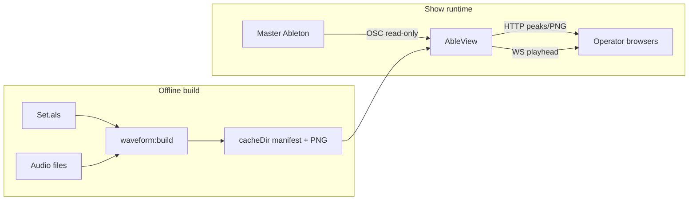

# M9 — Waveform + playhead

Build plan for offline waveform assets and realtime playhead in operator views. Implements spec
§11 extension point (“waveform + playhead”); does **not** change NFR-1 (read-only Ableton).

**Agent workflow:** one sub-milestone (M9a–M9d) per session/commit. Run `npm test` after each
stage. Prototype with `npm run sim` before Live validation.

**Related:** [`ableview_spec_from_claude.md`](../../ableview_spec_from_claude.md) §11,
[`ROADMAP.md`](../../ROADMAP.md), [`AGENTS.md`](../../AGENTS.md).

---

## 1. Goal and non-goals

### Goal

- Show a **static waveform image** (or equivalent) for the authoritative cue-track clip, plus a
  **realtime playhead** that tracks Live playback.
- **Offline build:** derive clip → audio file mapping from the Live set (`.als`) and project
  folder; generate and store waveform assets on disk before show night.
- **Show runtime:** on clip change, load pre-built assets; stream playhead position from
  read-only AbletonOSC. No audio decode on the hot path when cache is warm.

### Non-goals

- Reading waveform data out of a running Ableton session at show time.
- Any write OSC to Ableton (tempo, fire clip, etc.) — NFR-1 permanent.
- Replacing TouchDesigner / tdableton for the visuals op (optional overlap is fine; AbleView
  targets browser operator views).
- Arrangement-view authoring as primary cue source (v2026 ingest is **cue track / Session**;
  arrangement clip names may appear as suffixes on clip names for matching only).
- Sample-accurate warp/loop visualization (document limitations; v1 uses file duration + OSC
  position as Live reports it).

---

## 2. Architecture

```
  OFFLINE (rehearsal / when set changes)
  ─────────────────────────────────────
  Set.als (gzip XML) + projectRoot
        → parse cue track clip slots (name + FileRef)
        → resolve audio paths on disk
        → generate PNG (+ meta.json) per clip
        → write manifest.json under waveform.cacheDir

  RUNTIME (show night)
  ───────────────────
  Master Ableton + AbletonOSC
        → read-only OSC: slot, name, playing_position, length
        → AbleView ingest (authoritative track/slot)
        → matcher → CuePayload (unchanged cadence)
        → separate playhead updates (high rate, no rematch)
        → browsers: load PNG from HTTP + draw playhead (WS)

  Typical host: backup Ableton laptop (mirrored project tree) or media server with same
  paths; OSC `abletonHost` points at the **master** Live machine.
```



---

## 3. Open decisions (defaults for implementation)

Confirm or override before M9c if show-specific needs differ.

| ID | Topic | Default for M9 |
|---|---|---|
| OD-W1 | Which views show the panel | **`band` only**; optional per-view `waveformPanel: true` in `config.views.*` |
| OD-W2 | Cache artifact format | **PNG** waveform image + **`meta.json`** per clip (`durationSeconds`, `sourcePath`, `builtAt`); aggregate **`manifest.json`** |
| OD-W3 | Manifest lookup key | **Normalized clip name** (same rules as matcher: lowercase, strip punctuation/version tags). Secondary key `trackIndex:slotIndex` in manifest for disambiguation warnings |
| OD-W4 | Build tool for PNG | Prefer **minimal deps**: decode via optional **`ffmpeg-static`** CLI spawn if present; else **WAV-only** in-process read with clear error for MP3/AIF. Document in plan runbook |
| OD-W5 | `.als` input | **Config** `waveform.alsPath` + `waveform.projectRoot`; CLI **`npm run waveform:build`** overrides paths via flags |
| OD-W6 | Playhead on WS | **Separate message type** `playhead` (do not attach high-frequency updates to `CuePayload` / rematch path) |
| OD-W7 | OSC `file_path` at runtime | **Optional** sanity check only; primary file map from offline build |

---

## 4. Data contracts

### 4.1 Manifest (`manifest.json` in `waveform.cacheDir`)

```json
{
  "builtAt": "2026-07-27T12:00:00.000Z",
  "alsPath": "C:/Show/MySet.als",
  "projectRoot": "C:/Show",
  "cueTrack": "Cue",
  "clips": [
    {
      "clipKey": "song-a-intro",
      "clipName": "Song A - Intro",
      "trackIndex": 2,
      "slotIndex": 0,
      "imagePath": "clips/song-a-intro.png",
      "metaPath": "clips/song-a-intro.meta.json",
      "durationSeconds": 42.5,
      "sourcePath": "C:/Show/Samples/intro.wav"
    }
  ]
}
```

- `clipKey`: filesystem-safe slug derived from normalized clip name (stable across builds if
  name unchanged).
- `imagePath` / `metaPath`: relative to `cacheDir`.

### 4.2 Per-clip meta (`*.meta.json`)

```json
{
  "clipName": "Song A - Intro",
  "durationSeconds": 42.5,
  "sourcePath": "C:/Show/Samples/intro.wav",
  "sourceMtimeMs": 1710000000000,
  "builtAt": "2026-07-27T12:00:00.000Z"
}
```

### 4.3 NowPlaying extension (ingest → matcher)

Add fields when `waveform.enabled` (matcher may ignore; server/waveform module uses):

```js
{
  // existing fields...
  authoritativeTrackIndex: number | null,
  authoritativeSlotIndex: number | null,
}
```

### 4.4 WebSocket: `playhead` message (server → views)

Sent throttled (e.g. max 15–30 Hz) or on meaningful change; client interpolates with rAF.

```json
{
  "type": "playhead",
  "clipName": "Song A - Intro",
  "clipKey": "song-a-intro",
  "trackIndex": 2,
  "slotIndex": 0,
  "positionSeconds": 12.34,
  "durationSeconds": 42.5,
  "at": "2026-07-27T12:00:01.000Z"
}
```

When no audio clip or no manifest entry: `durationSeconds` null, `waveformStatus`:
`"none" | "missing" | "midi" | "ready"`.

Initial view `init` message may include `waveformEnabled` and current `waveformStatus`.

### 4.5 Bus

- Keep `EVENTS.NOW_PLAYING` / `EVENTS.CUE_PAYLOAD` as today.
- Add `EVENTS.PLAYHEAD` (or equivalent) subscribed only by server broadcast layer — **not** by
  matcher.

---

## 5. Configuration

Add to `config/config.example.json` when implementing M9a (documented here first):

```json
{
  "waveform": {
    "enabled": false,
    "cacheDir": "./data/waveform-cache",
    "projectRoot": "C:/Show",
    "alsPath": "C:/Show/MySet.als",
    "cueTrack": "Cue",
    "pngWidth": 1200,
    "pngHeight": 80
  }
}
```

- `cueTrack`: defaults to `ingest.authoritative.track` when omitted.
- `enabled: false`: no OSC playhead listeners, no HTTP waveform routes, views hide panel.

Per-view (M9d):

```json
"band": {
  "title": "Band",
  "waveformPanel": true,
  "fields": [ ... ]
}
```

---

## 6. ALS parsing notes

- Live set files (`.als`) are **gzip-compressed XML**. Decompress before parse (e.g. gunzip /
  zlib), not plain rename-to-`.xml`.
- Locate the track whose `@Name` (or equivalent Live XML attribute) matches `cueTrack`.
- Session View: enumerate clip slots; read clip **name** and **SampleRef** / **FileRef** for
  audio clips.
- Resolve relative paths against `projectRoot`.
- **MIDI clips** and empty slots: include in manifest with `"kind": "midi" | "empty"` and no
  image; runtime shows playhead-only or “no waveform”.
- After Live edits: **save set → re-run `waveform:build`**; manifest `builtAt` drives admin
  staleness hint.

Optional validation: compare manifest clip names to in-memory sheet `matchColumn` values; warn
on sheet rows with no audio clip and clips with no sheet row.

---

## 7. NFR-1: OSC allowlist additions (M9c)

Add read/listen only (verify against AbletonOSC docs):

| Address | Purpose |
|---|---|
| `/live/clip/get/length` | Clip duration for scrub bar fallback |
| `/live/clip/get/playing_position` | Position replies |
| `/live/clip/start_listen/playing_position` | Stream position |
| `/live/clip/stop_listen/playing_position` | Teardown on clip change |

Optional (not required if using ALS build):

| `/live/clip/get/file_path` | Runtime sanity vs manifest |

Extend `test/nfr1-readonly.test.js`; no write addresses.

**Listener lifecycle:** start/stop `playing_position` for authoritative `(trackIndex,
slotIndex)` only; stop on slot change, ingest reload, and shutdown (mirror existing
`stop_listen` patterns in `abletonosc.js`).

---

## 8. Build stages

### M9a — Contracts, config, static serve

**Scope**

- Config loader validation for `waveform` section.
- Types/helpers: `clipKey` from normalized clip name (reuse or import matcher normalize).
- Read manifest from `cacheDir`; serve `GET /waveform/manifest.json` and
  `GET /waveform/clips/:clipKey.png` (and meta) with path sandbox under `cacheDir` only.
- `waveform.enabled: false` → routes absent or 404; no behavior change elsewhere.

**Files (expected)**

- `src/waveform/` (manifest loader, paths)
- `src/config/index.js`
- `src/server/index.js` (routes)
- `config/config.example.json`
- `test/waveform-manifest.test.js`

**Acceptance**

- Fixture manifest + PNG in `test/fixtures/waveform-cache/` loads and serves in tests.
- `npm test` green; NFR-1 unchanged.

**Out of scope:** ALS parse, PNG generation, ingest OSC, UI.

**Agent prompt**

> Implement M9a per `docs/plans/M9-waveform-playhead.md`: waveform config, manifest schema,
> sandboxed static HTTP from `cacheDir`. No ingest or view changes.

---

### M9b — Offline build (`npm run waveform:build`)

**Scope**

- CLI: `node src/waveform/build-cli.js` (or `scripts/waveform-build.js`) registered as
  `npm run waveform:build`.
- Decompress and parse `.als`; extract cue track audio clips and paths.
- Generate PNG + per-clip meta; write `manifest.json`.
- Flags: `--als`, `--project-root`, `--cache-dir`, `--cue-track` (override config).
- Sheet cross-check warnings (stdout / non-zero exit optional `--strict`).

**Files (expected)**

- `src/waveform/als-parse.js`
- `src/waveform/render-png.js` (ffmpeg and/or WAV path per OD-W4)
- `src/waveform/build.js`
- `test/fixtures/minimal.als.gz` or small gzip XML fixture + tiny WAV
- `test/waveform-build.test.js`

**Acceptance**

- Build against fixtures produces deterministic manifest + PNG without Live running.
- Re-run is idempotent (same inputs → same `clipKey` files).
- `npm test` green.

**Out of scope:** Runtime playhead, browser UI.

**Agent prompt**

> Implement M9b per `docs/plans/M9-waveform-playhead.md`: ALS parse + offline PNG build CLI
> and fixture tests.

---

### M9c — Realtime playhead (ingest + sim + WS)

**Scope**

- Extend `NowPlaying` with authoritative track/slot indices when resolvable.
- OSC allowlist + `abletonosc.js`: length, playing_position listen lifecycle tied to
  authoritative slot (respect pending launch / fired vs playing same as cue resolution).
- Emit playhead on internal bus; server broadcasts `type: playhead` WS messages throttled.
- Simulator: advance `positionSeconds` over step `holdSeconds` for audio-like steps.
- Extend OSC sim emitter if needed for playing_position replies in `sim.mode: osc`.

**Files (expected)**

- `src/ingest/osc-addresses.js`, `src/ingest/sources/abletonosc.js`
- `src/core/now-playing.js`, `src/core/bus.js` (event name)
- `src/ingest/sources/simulator.js`, `src/sim/osc-emitter.js`
- `src/server/index.js`
- `test/nfr1-readonly.test.js`, `test/playhead.test.js`

**Acceptance**

- Sim: clip change + moving playhead visible via WS test or small integration test.
- Matcher not invoked on playhead-only ticks (assert call count or event separation).
- NFR-1 tests pass with new allowlist entries.

**Out of scope:** Waveform panel rendering (WS JSON sufficient).

**Agent prompt**

> Implement M9c per `docs/plans/M9-waveform-playhead.md`: read-only playing_position ingest,
> sim playhead, separate WS playhead messages. Do not add view HTML yet.

---

### M9d — View panel, admin, runbook

**Scope**

- `waveformPanel` on configured views: load PNG from HTTP, overlay playhead from WS; rAF
  interpolation between updates.
- Degraded UI: missing manifest entry, MIDI, disabled, stale build.
- Admin: manifest `builtAt`, clip count, current clip waveform status, link to runbook step.
- `docs/plans/M9-waveform-playhead.md` rehearsal section remains source of truth; optional
  one-line in `deploy/README.md` pointing to M9 runbook.
- Update `ROADMAP.md` M9 status when complete.

**Files (expected)**

- `public/shared/waveform-panel.js` (or extend `view-render.js`)
- `public/views/band.html` (if panel mounted per view config)
- `public/shared/ws-client.js`
- Admin render path in `public/shared/view-render.js`

**Acceptance**

- `npm run sim` with `waveform.enabled: true` and fixture cache: band view shows bar + moving
  playhead.
- Clip change swaps PNG within same latency budget as cue text (~200 ms perceived).
- Admin shows build metadata when manifest present.

**Out of scope:** ffmpeg bundling in production deploy (document optional install).

**Agent prompt**

> Implement M9d per `docs/plans/M9-waveform-playhead.md`: view waveform panel, admin status,
> degraded states. Enable band view in example config comments only.

---

## 9. Rehearsal runbook

1. On the machine that holds the **mirrored project** (backup laptop or media server), save the
   Live set (`MySet.als`).
2. Set `waveform.projectRoot`, `waveform.alsPath`, `waveform.cacheDir` in `config.json`.
3. Run `npm run waveform:build` (fix warnings: missing files, sheet name mismatches).
4. Commit or rsync `data/waveform-cache/` to the show box if build runs off-target.
5. Start AbleView; set `ingest.abletonHost` to **master** Live IP; `waveform.enabled: true`.
6. Open band view; launch clips on cue track — verify PNG + playhead track Live.
7. After any set change: repeat steps 1–3 before doors.

---

## 10. Known limitations (v1)

- Playhead uses Live-reported **playing position**; may not match unwarped file pixels under
  heavy warp unless Live and file duration align.
- Loop braces not drawn; looping clips may show playhead wrapping or clamp — pick clamp +
  label in M9d unless time allows loop metadata from ALS.
- Duplicate clip names in multiple slots: last-write-wins in manifest unless `clipKey` includes
  slot (OD-W3: warn in build).
- Single AbleView instance should own playhead OSC listeners (avoid duplicate listeners from
  two boxes against one Live).
- OSC unicast: only the host running ingest receives position streams from AbletonOSC.

---

## 11. Effort (human planning only)

| Stage | Raw dev | Agent-assisted (indicative) |
|---|---|---|
| M9a | 1–2 days | ~0.5–1 day |
| M9b | 2–4 days | ~1–2 days |
| M9c | 2–3 days | ~1–1.5 days |
| M9d | 2–3 days | ~1–2 days |
| **Total** | **~1.5–2.5 weeks** | **~4–7 working days** + Live rehearsal |

Rehearsal and path parity on Windows show machines are not automatable; ALS-driven build
avoids most OSC/file-path harvest pain discussed in early scoping.

---

## 12. Milestone completion checklist

- [ ] M9a — manifest serve + config
- [ ] M9b — `waveform:build` + fixture tests
- [ ] M9c — playhead ingest + WS + sim
- [ ] M9d — views + admin + runbook verified in sim
- [ ] `ROADMAP.md` M9 marked done
- [ ] Optional: spec §11 one-line link to this plan
